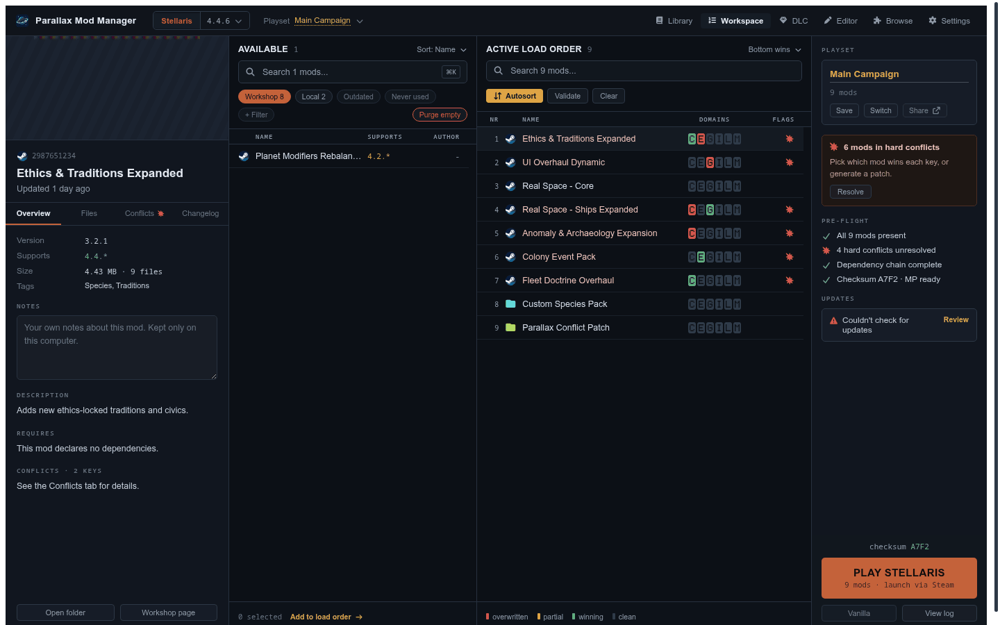
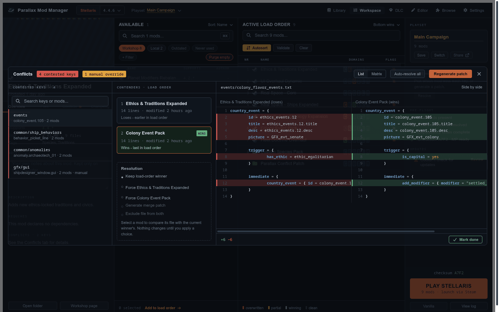
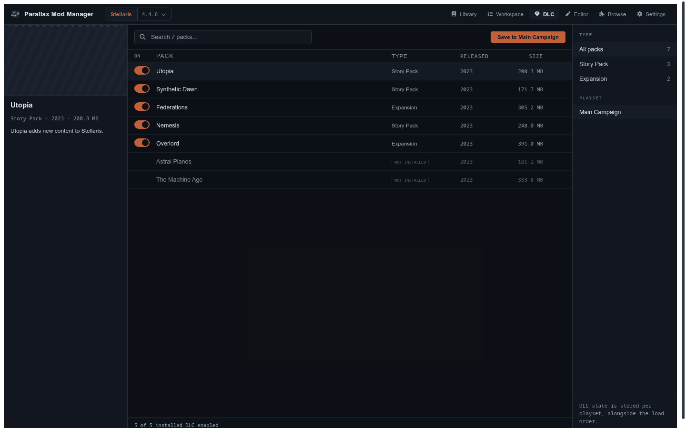
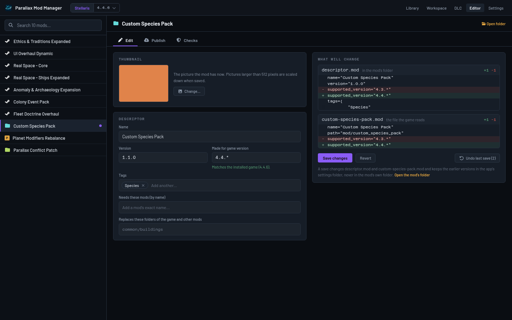

<p align="center">
  
</p>

<h1 align="center">Parallax Mod Manager</h1>
<p align="center"><strong>A from-scratch Paradox mod manager, built with a Go backend to fix the performance problems the existing ones are known for.</strong></p>

<p align="center">
  <a href="https://github.com/Official-Husko/parallax-mod-manager/actions/workflows/build.yml"></a>
  <a href="https://github.com/Official-Husko/parallax-mod-manager/actions/workflows/vulncheck.yml"></a>
  
  
  <a href="LICENCE.md"></a>
  
  
</p>

A mod manager for Paradox Interactive grand strategy games (Stellaris, EU4, HOI4, CK3,
Victoria 3, and friends) - a from-scratch reimplementation built on a Go backend instead of
.NET/Avalonia, and specifically designed to fix performance problems well known in this space
(see [Why not just use Irony?](#why-not-just-use-irony)). See
[docs/performance-strategy.md](docs/performance-strategy.md) for the research behind that
claim, and [docs/](docs/) generally for the Paradox-modding domain knowledge this project is
built on.

**Status: early development.** The desktop shell runs a real scan end to end: pick a game, list
its installed mods, arrange an enabled/ordered playset, save it, resolve real conflicts (with
real load-order winners and a real overlap matrix), and launch the game with that playset
active. Six Paradox games are registered (data-driven, not hardcoded - see
[Progress](#progress)), though only Stellaris has actually been verified against a real install
so far. A first-run wizard detects installed games for real and lets you point it at one
auto-detection misses. DLC toggling per playset is real too. The rest of the app's screens (a
cross-game library, playset sharing) exist as a faithful visual preview of where this is headed,
but aren't functional yet - see [Progress](#progress) for exactly which parts are real and which
are still a mockup. Nothing here is ready to fully replace your existing mod manager yet.

The screenshots below are real UI, driven with sample data for the shots (not a live install) -
Stellaris is the only game verified against a real one so far.

<table>
<tr>
<td width="50%">

<br><sub>Workspace - build a load order, see conflicts and dependency issues before you launch</sub>
</td>
<td width="50%">

<br><sub>Conflict Resolver - side-by-side diffs and one-click patch generation</sub>
</td>
</tr>
<tr>
<td width="50%">

<br><sub>DLC - toggle installed DLC per playset, with Steam Store details</sub>
</td>
<td width="50%">

<br><sub>Editor - edit a mod's descriptor and thumbnail, previewed before you save</sub>
</td>
</tr>
</table>

## Highlights

A quick tour - see [Progress](#progress) below for exactly what's real today versus still a
mockup, and [features.md](features.md) for the full, one-line-each list.

**Mods and load order**
- Discovers Workshop, Paradox Launcher and local mods, with live folder watching and personal
  per-mod notes.
- Drag-and-drop load order with autosort (dependencies first, fixes and patches last) and
  pre-flight checks before you launch.
- A cross-game library with search, sizes, and collections for bulk actions.

**Conflicts and patching**
- Real load-order conflict detection, dependency-aware suppression, and a resolver with
  side-by-side diffs and an overlap matrix.
- A generated patch mod with the winning content of every conflict, byte for byte, with
  staleness detection when a source mod changes.

**DLC and multiplayer**
- Per-playset DLC toggling, including DLC you do not own, shown honestly as not installed.
- The four-character multiplayer checksum (Stellaris, Hearts of Iron IV), calculated offline
  whenever a playset is saved or loaded.

**Launching and Workshop data**
- Launches with the playset active through Steam or directly, with a live, filterable game log.
- Real Workshop details (subscribers, author, changelog) and an optional Steam Web API key for
  what the free API cannot see.

**Mod preservation**
- Copies a Workshop mod's files the moment it is found deleted or private, before Steam removes
  them for good.

**Editor**
- Edit a mod's own descriptor and thumbnail with a live preview of exactly what changes, and
  Undo last save if you change your mind. Steam and launcher mods stay read-only.

**Trust and performance**
- No account, no telemetry - the only outside services are Steam and, for background art,
  GitHub.
- Incremental caching throughout: unchanged mods and unchanged checksums cost almost nothing on
  the next run.
- Settings, playsets and caches are always written atomically - a crash never leaves a
  half-written file.

## Why not just use Irony?

Irony works, and this project owes its domain knowledge to reading its source. But it has
real, documented problems: 5–7 minute load times on large mod lists, memory that the
maintainer has confirmed can hit ~6GB with 200+ mods "by design," and several long-open
GitHub issues where the app hangs indefinitely with no way to tell if it's still working or
stuck. The root cause, found by reading Irony's own code
([docs/performance-strategy.md](docs/performance-strategy.md)): it has **zero cross-run
caching for mod files** - every launch fully re-parses every enabled mod from scratch, with
concurrency hardcoded to 4–6 mods regardless of how many CPU cores are available.

| | Irony Mod Manager | Parallax Mod Manager |
|---|---|---|
| Cross-run mod caching | None - full re-parse every launch | Stat → hash → parse layered cache; unchanged mods cost near-zero on relaunch |
| Parsing parallelism | Hardcoded cap (4–6 mods), regardless of CPU count | Worker pool sized to `runtime.NumCPU()` |
| Content hashing | Fast non-cryptographic (MetroHash) - already reasonable | Same idea (xxHash), plus a single chokepoint package (`internal/xhash`) so it can't accidentally be swapped for something disk-unsafe |
| Conflict detection | O(n) hash-bucket grouping - already reasonable | Same approach, plus dependency-aware suppression and a same-mod cross-file collapse Irony's design doesn't need to distinguish (see `internal/conflict`) |
| Cache integrity | One confirmed real bug: bad state trusted silently, corrupting the cache | Versioned format, fails closed to "re-parse this one mod" on any corruption or version mismatch - never propagates bad state |
| Progress feedback | Phase-level; several GitHub issues report indefinite, indistinguishable-from-hung scans | The mod list itself (names, versions, sources) needs no content parsing, so it renders immediately instead of waiting behind a "Scanning..." wall - confirmed on a real 86-mod install, the list appears in ~1ms versus ~6s for the full conflict-resolved result |
| Runtime | .NET + Avalonia | Go + Wails (native webview, no bundled runtime) |

This list grows as features land - see [Progress](#progress) below, which is kept current.

## Stack

- **Backend**: Go, via [Wails v2](https://wails.io).
- **Frontend**: TypeScript + Preact + Vite, under `frontend/`.
- **Reference material**: a read-only clone of an existing open-source Paradox mod manager
  lives locally at `reference-src/` for research purposes only - it's git-ignored and not part
  of this codebase. See [CLAUDE.md](CLAUDE.md).

## Progress

<details>
<summary><strong>Full progress log</strong> - every feature, done and not yet built (click to expand, kept current with every change)</summary>

### Done

- **Wails desktop shell** - `main.go`/`app.go` at the repo root, Preact+TS+Vite frontend,
  builds to a native binary via `wails build`.
- **Clausewitz script parser** (`internal/script`) - tokenizer + recursive-descent parser
  for the `key = value` / nested `{ }` format almost all Paradox game/mod content is written
  in, including `@variable` definitions/references and comparison operators.
- **Localization parser** (`internal/locale`) - the separate `.yml` format.
- **Mod descriptor parsing** (`internal/mod`) - both the classic Clausewitz `descriptor.mod`
  format and the newer Paradox Launcher JSON format (v1 and v2 relationship shapes); source
  classification (Steam Workshop / Paradox Launcher / local) by filename convention.
- **Steam Workshop resolution** (`internal/steam`) - parses Steam's own
  `libraryfolders.vdf` to find the right Workshop content folder across multiple libraries, and
  across multiple Steam installation roots (a native install and a Flatpak one, say) - every
  root is tried, not just the first.
- **Per-game configuration** (`internal/game`) - executable discovery via the Paradox
  Launcher's own `launcher-settings.json`, with a fallback (its exact location varies per game -
  most keep it at the install root, some nest it under a `launcher/` subfolder). The user-data
  directory is OS-aware (Linux uses `$XDG_DATA_HOME`, not a Windows-style Documents folder),
  confirmed against a real Linux Stellaris install - which also confirmed Stellaris ships a
  native Linux binary, no Proton involved. See the data-driven game registry entry below for
  where each game's configuration actually comes from now.
- **Mod scanner** (`internal/scan`) - discovers and classifies every mod in a game's user
  mod folder; a bad descriptor is a non-fatal per-mod error, not an aborted scan. Also
  independently discovers subscribed Steam Workshop items the game hasn't linked into that
  folder yet: confirmed on a real install, a subscribed item's content can be fully downloaded
  with no `mod/ugc_<id>.mod` stub for it at all (Steam/the Paradox Launcher appear to write that
  file lazily, not the moment a subscription finishes) - since every Workshop item's own content
  folder already carries its own self-contained descriptor, the scanner reads that directly
  instead of waiting for a stub to exist. When such a mod is actually enabled in a playset,
  launching writes the missing stub (mirroring the item's own descriptor, never overwriting one
  Steam or the launcher already wrote) so the game can actually find it - see
  [docs/mod-sources.md](docs/mod-sources.md).
  The same launch-time step (`scan.EnsureStub`) also makes **mods in custom folders load in the
  game**: the game only ever follows the stub in its own mod folder, so a mod this app finds
  through an extra mod folder (no stub at all), or through a stub whose `path=` still names a
  library that moved (another drive, another mount name), looked fine in the manager but was
  never loaded. Every enabled mod now gets a stub that points at the folder it really is in - a
  missing one is written, a stale `path=` line is rewritten in place (name, tags and comments
  stay byte for byte; a stub that already works is never touched) - and the activity log and a
  notification say what was repaired and which enabled mods could not be found anywhere. A stub
  with no `path=` at all is no longer mistaken for content in the mod folder itself.
- **Incremental cache** (`internal/cache`) - the stat → hash → parse layered, on-disk,
  versioned cache described above. This is the project's core performance thesis, and it's
  the one piece the research found nothing surveyed in this space (not the reference codebase,
  not the Rust `tiger` validators, not CWTools) has actually built. Persisted as `gob`, not
  JSON: a real large Workshop mod's cache file (confirmed on a ~1,800-file total conversion)
  reached 165MB as JSON, and just *loading* it back - before any actual parsing - cost over half
  a second on every call, undermining the whole point of a 100%-cache-hit relaunch. Gob measured
  roughly half the file size and 3-5x faster to encode/decode on that same real data; see
  [docs/performance-strategy.md](docs/performance-strategy.md) for the full before/after.
- **Fast warm rescans** (`internal/pipeline`, `internal/conflict`, `internal/library`) - a rescan
  (every scan, manual pick, patch generation or mod-folder change) with every cache file warm went
  from about 2.3 s to about 0.3 s on this project's real 86-mod install (now 1.27 million definitions
  from 81 mods): unchanged mod caches are no longer rewritten on every run, conflict detection only
  examines keys more than one mod defines instead of resolving all of them, the index is built in
  parallel shards, mods are read several at a time (results still merged in load order), and the cache
  uses a compact binary record that stores each file's repeated strings once (bounds-checked, so a
  corrupt cache is simply rebuilt). Each change has a test proving the result is identical to the slow
  path. See
  [docs/performance-strategy.md](docs/performance-strategy.md) for the profile and what's left.
- **The multiplayer checksum caches its own result** (`internal/checksum`) - a checksum is asked for
  again on every playset save and load and whenever mod files change on disk, and in the common case
  nothing on disk actually changed since the last call. Reading and hashing every game and mod file
  again to find that out measured about 80ms for a small Stellaris playset over 2,332 files on this
  project's real install; a fingerprint of every file's path, size and modification time, built from
  the same walk `Compute` already does to find the files (nothing extra is read to build it), lets a
  repeat call for the same game and mod set skip the expensive read-and-hash pass entirely when
  nothing has changed - about 20ms on that same install, and any real change (a file added, removed,
  edited, or the enabled mods themselves changing) is guaranteed to invalidate it, the same
  cache-verify-on-read rule the mod-parsing cache above follows. A table of tests proves every kind of
  change is detected and a cache hit never reads a file's content.
- **Localisation parsing fixes** (`internal/locale`, `internal/cache`) - the activity log's new cache
  line showed 645 files on the real install being silently skipped as unparseable. 629 had a `#`
  comment after a value (valid in the game's own files), one had a doubled BOM, and a few dozen had one
  malformed line that cost the whole file; all three are fixed (a bad line is now skipped and noted, the
  rest of the file is kept, as the game does). About a thousand localisation conflicts had been hidden:
  contested keys on that install went from 4,788 to 5,841. Every mod cache is stamped with a parser
  version (`cache.ParserVersion`), so a fixed parser gets a fresh look at files it once rejected instead
  of trusting a stale "failed" verdict.
- **Patch status no longer cries wolf at startup** (`internal/library`) - the first scan of every
  launch has no playset yet, so nothing is loaded and nothing conflicts; every key the generated
  patch covers then looked "no longer conflicting", and a persistent "patch is out of date" warning
  was raised until the real scan replaced it. With no mods loaded there is nothing to compare the
  patch to, so it is now reported as present and left unjudged. (The activity log's own repeated
  status line is what exposed it: the same warning appeared on 86 of 771 lines.)
- **Parsing pipeline** (`internal/pipeline`) - wires the cache and parsers together behind a
  bounded worker pool; parses one mod's files in parallel, merges results in deterministic
  order (parse in parallel, merge sequentially - load-order correctness, not just speed), and
  reports per-file progress.
- **Conflict detection** (`internal/conflict`) - indexes every enabled mod's parsed
  definitions by `(Type, ID)`, tells genuine conflicts apart from duplicated content via
  content-hash comparison, and resolves each genuine conflict to a winner via a per-Type
  LIOS/FIOS load-order rule. Two things beyond the base algorithm: dependency-aware
  suppression (a declared mod dependency can explain away what would otherwise be a
  conflict, without ever letting a partially-explained 3+-way conflict go silently
  unreported), and correctly collapsing a *single* mod's own same-key duplicates across its
  own files before any cross-mod comparison happens - the Clausewitz engine's "later file
  wins" doesn't care whether the two files belong to the same mod or different ones, so
  detection has to apply the same rule either way. Pure, no file I/O - see
  [docs/conflict-resolution.md](docs/conflict-resolution.md).
- **Settings > Conflict rules** - which content types are FIOS instead of the LIOS default.
  `conflict.DefaultPriorityRules` only ever grows from a confirmed source, never a guess (a
  regression test pins it to exactly that); one is confirmed so far, Stellaris' own
  `common/static_modifiers`, from Paradox's own wiki fetched live while researching this
  ("place a changed static modifier... in a new file that comes before asciibetically" - the
  earliest-loaded definition wins, not the latest). Rather than this project trying to divine the
  rest centrally, a person's own per-Type override (`internal/priorityrules`, one JSONC file per
  game) layers on top of the built-in defaults - `library.Options.RuleOverrides`, merged the same
  way for both a scan and a generated patch (`internal/library`'s own `effectiveRules`, the one
  place that combination happens) so they never disagree about which rule applies to which Type.
- **Game launching, including real `mods_registry.json`/`game_data.json` UUID tracking**
  (`internal/launch`) - writes `dlc_load.json` (the ordered enabled-mods list + disabled-DLC
  list a classic-descriptor game reads on startup), confirmed byte-for-byte against a real
  Stellaris install, then launches the game via the Steam protocol URL (falling back to a
  direct executable for non-Steam installs). `game_data.json`'s `modsOrder` field holds mod
  UUIDs from `mods_registry.json`, a different identifier space than `dlc_load.json` entirely -
  this project now maintains its own UUID per mod there too, reusing an existing entry's UUID
  (matched by its `gameRegistryId`, the same `"mod/<id>.mod"` string `dlc_load.json` uses) when
  one's already registered rather than minting a fresh one every launch, so the UUID a mod gets
  stays stable across launches. Both `mods_registry.json` and `game_data.json` are read-merge-
  write, not a full overwrite like `dlc_load.json` - entries/fields this project didn't touch
  (another mod's registry entry, `game_data.json`'s own `isEulaAccepted` flag) round-trip
  completely untouched rather than getting silently reset or dropped. The one function in this
  package allowed to actually open a URL or spawn a process sits behind a small `Launcher`
  interface - nothing else in the package, and nothing in its test suite, can touch the real OS.
  Writing state requires an explicit target directory with **no fallback to a real path** -
  stricter than `internal/scan`'s override, because this package writes rather than reads. See
  [docs/game-launching.md](docs/game-launching.md).
- **Stop playing, and the game's own logs live** (`internal/gameproc`, `internal/gamelog`,
  `Workspace.tsx`, `GameLogModal.tsx`) - while the game is running the **Play** button
  becomes a red **Stop playing** button, however the game was started (from here, from Steam, from the
  Paradox Launcher), and it turns back the moment the game closes. A first press only asks ("click
  again to stop", it lapses after a few seconds), since ending a game loses whatever it hadn't
  saved; the second asks the game to close and forces it if it hasn't after five seconds. The game
  is recognised by its own executable's name, never by a substring of a command line (a file
  manager with the game's mod folder open is not the game, and would otherwise have been killed);
  a launcher script such as Hearts of Iron IV's `run_hoi4` is followed to the real program it starts,
  so stopping ends both. Under Proton the same names with `.exe` are matched too. The button under
  Play, formerly a disabled "Export log", is now **View log**: a live window on the game's own log
  files (`error.log` first, since that is where broken mods show up), with the last lines at once and
  new ones as the game writes them, filterable by warnings or errors and by text, with a dot showing
  whether the game is running. Both logs are colored to be read at a glance: the game's name is
  drawn in its own accent color, each level filter carries its level's color (blue, amber, red),
  warning and error lines get a colored edge, and inside a message file paths (blue), versions
  (violet), ids and hashes (teal), quoted names and numbers each have their own hue. When there is
  nothing to list (no log yet, an empty file, a filter that matches nothing, a read failure) the
  window shows an icon and a sentence saying which, centered in the log area. The follower copes with what these files actually do: the game
  truncates them on every start (the view resets), can append megabytes in a second (only the newest
  is read, and the skip is noted), and writes a line in pieces (a line appears only once complete).
  Process listing and stopping is written for Linux (`/proc`), Windows and macOS; it has been run
  against real processes on Linux only. See [docs/game-launching.md](docs/game-launching.md).
- **Domain bars with the letter cut out** (`Workspace.tsx`, `Workspace.css`) - each row of the Active
  load order shows six bars, one per content folder (C common, E events, G gfx, I interface,
  L localisation, M map), coloured by what really happens to that mod there: red when everything it
  contests is lost, amber for a mix, quiet grey when it wins or isn't contested. The letter is stenciled
  into the bar itself instead of being printed separately in the column header: each bar is a CSS mask
  with the letter as a hole, so the row's own background (hover, selected) shows through it. The glyphs
  are drawn as SVG shapes rather than font text, so they look the same on every platform.
- **Launcher bypass, opt-in per game** (Settings' Launch Options panel, `launch.LaunchMode`) -
  since mod/playset activation already happens entirely through this project's own state writes
  above, the Paradox Launcher has nothing left to do; "Parallax Direct" mode resolves and starts
  a game's real executable straight from its own `launcher-settings.json`, skipping the launcher
  (and Steam) entirely. Configured one game at a time - each game gets its own choice between the
  normal Steam / Paradox Launcher path (the default) and Parallax Direct, since Steam
  integration (overlay, achievements, DLC ownership checks) isn't guaranteed to carry over to a
  directly-spawned process on every game. Fixed a real path-resolution bug along the way:
  `launcher-settings.json`'s own `exePath` is relative to *its own* directory, not the install
  root - true for Stellaris/EU4/HOI4, where the two are the same, but CK3, Imperator: Rome, and
  Victoria 3 nest it under a `launcher/` subfolder, so the previous `installDir`-relative join
  pointed outside the install for those three. A second bypass strategy - replacing the
  launcher's own binary with a small shim so Steam keeps owning the process, shown in the UI
  today as "Steam Direct (Recommended)" - is designed for (`LaunchMode` is a named string, not a
  bool, specifically so it can be added later); once fully wired up, it's intended to become the
  default, since it keeps Steam integration Parallax Direct can't promise on every game.
- **Steam Direct is real now, end to end** - the standalone shim (`companions/launcher-shim/`,
  its own separate Go module - own `go.mod`, standard library only, so it stays small and easy
  to audit on its own merits) replaces a game's own `dowser`/`dowser.exe` (confirmed, by
  disassembling a real, unstripped copy of it from this machine's own Stellaris and Hearts of
  Iron IV installs, to be nothing more than a bootstrapper for the Paradox Launcher itself, with
  no "skip the launcher" mode of its own - a replacement really is the only way), reads that
  game's `launcher-settings.json`, and execs the real executable in its place (`syscall.Exec` on
  Linux - true process-image replacement, so Steam's own environment and process context carry
  through exactly as it set them up). It reports its own outcome to a small status file, and
  makes one best-effort, bounded live ping if Parallax happens to already be running. Never
  carries a copy of its own source anywhere - `--source` prints a link to this repository
  instead, same as the runtime notice file it leaves behind.
  Parallax's own side, `internal/launchershim`: Settings > Launch options offers "Steam Direct"
  as a real, selectable mode once a game is confirmed to support it (`GameConfig.LauncherShimSupported`
  - Stellaris and Hearts of Iron IV so far). Installing backs up the real launcher file first
  (atomic rename) and verifies the shim actually landed before calling it done, restoring the
  original automatically if anything fails along the way; it also detects and one-click repairs
  the case where Steam's own "Verify integrity of game files" quietly restores the original
  (a real backup sitting next to something that is not the shim anymore); removing restores that
  same backup and deletes the runtime notice file. Confirmed live, byte-for-byte, against a
  scratch copy of this machine's real Stellaris install - installed, detected healthy, removed,
  restored file checksum-identical to the original. Installing or repairing always fetches the
  newest published build of the shim from this project's own GitHub releases first, falling back
  to the copy `build.sh` places next to the main app's own build output (`build/bin/companions/`,
  not `go:embed`-ed - impossible across the module boundary anyway) only if that fetch fails for
  any reason, and telling you plainly if both fail. A fixed local port carries the shim's live
  ping to a running app, shown as a toast ahead of `internal/gameproc`'s own polling. See
  [docs/game-launching.md](docs/game-launching.md).
- **Play never depends on a playset being loaded** (`app.go`'s `LaunchGame`) - launching with no
  playset name selected skips every one of this project's own state writes (`dlc_load.json`,
  `mods_registry.json`, `game_data.json`) entirely and starts the game against whatever's already
  on disk untouched, rather than refusing to launch or inventing an empty state of its own. Paired
  with a new **Playsets** settings panel (renamed from the former "Playset sharing" placeholder
  entry) that configures, one game at a time, whether Workspace automatically reloads a playset
  when you open that game: off (always start blank), autoload whichever one was last saved or
  switched to (the default), or always autoload one specific pinned playset regardless of what
  else you've used since. Playset sharing itself (export/import as a shareable code) now lives as
  its own row inside that same panel rather than a top-level tab, still unbuilt - see
  [Not yet built](#not-yet-built).
- **Importing existing Paradox Launcher playsets** (`internal/launcherdb`) - reads a game's real
  `launcher-v2.sqlite`, strictly read-only (confirmed schema against real, live databases for two
  different classic-descriptor games on this machine, not just a secondary source - see
  [docs/launcher-database.md](docs/launcher-database.md)), and lists every playset it holds with
  its own mods in real load-order position. The Workspace's own Playsets switcher shows whatever's
  found under a "From the Paradox Launcher" section; importing one loads it as the current,
  unsaved draft - the same "build it, then explicitly Save" flow "New" already uses, not an
  immediate write into this project's own playset storage - resolving each mod back to this
  project's own id and reporting (never silently dropping) anything not currently found by this
  project's own scan. A fixture test proves the read-only connection actually rejects a write,
  not just documents the intent as a comment.
- **Wired UI** (`internal/library`, `app.go`, `frontend/src/app.tsx`) - a real scan view: pick a
  game, and `ScanGame` runs the full scan → parse → conflict-resolve chain and renders the mod
  list and any conflicts. `internal/library` owns the orchestration and the frontend-facing
  summary types; `app.go` stays a thin adapter (per `CLAUDE.md`) that resolves the one real OS
  path (`os.UserCacheDir()`) this layer needs. Two boundary pitfalls worth knowing about if
  extending this: Wails maps Go's `uint64`/`int64` straight to a JS `number`, which silently
  loses precision past 2^53 - so summary types never carry a raw hash field, only what the UI
  actually needs; and Go `iota` enums (`mod.Source`, etc.) are converted to strings
  (`"workshop"`, not `1`) before crossing the boundary, since a bare int means nothing in JS.
  Verified against the installed Wails v2 source, not assumed. `ScanGame` also emits a
  `scan-quick` event partway through its own run: a mod's name/version/source needs no content
  parsing, so the full mod list is known - and pushed to the frontend - well before conflict
  detection's slower per-mod parsing finishes, letting the Workspace view render the list
  immediately instead of sitting behind a blocking "Scanning..." state (`internal/library`'s
  `LoadGame` takes an `OnQuickSummary` callback for this; `app.go` is the only thing that turns
  it into a Wails event). Confirmed against a real 86-mod install: the list appears in about a
  millisecond, roughly 5000× before the fully conflict-resolved result lands a few seconds later.
- **Playsets and game launching** (`internal/playset`, `internal/library`, `app.go`,
  `frontend/src/app.tsx`) - named, ordered mod selections persisted as versioned JSON
  (Paradox's own "playset" term, not a generic "collection"), following the same irreplaceable-
  user-data philosophy as `internal/launch`'s state writes: a corrupt or version-mismatched
  playset file errors on load rather than silently resetting to empty. A mod left out of a
  playset's order is skipped by `internal/library` before parsing even starts, not just
  filtered out afterward - disabling mods is a real scan-time performance win, not just a
  smaller conflict set. Saved playsets can be **renamed and deleted** from the Playsets dialog:
  a rename keeps the mods, order and DLC choices exactly, refuses a name that's empty or already taken
  (judged on the file the name would land in, since names are sanitized into file names, so it can
  never overwrite another playset), writes the new one before removing the old so a failure can't lose
  it, and repoints the settings that remember a playset by name (last active, pinned for auto-load);
  deleting one clears those settings, and never throws away the load order on screen. The app also
  **notices when a game updates**: it remembers each game's last-seen version, checks at startup and
  whenever the window regains focus (Steam may have updated it in the background), and raises a
  persistent notification once per update - and a generated patch made for another game major.minor
  is flagged as out of date. The Workspace UI (available/active load-order lists, a mod detail
  panel, and an actions rail with the playset picker and the launch button) adopts the visual
  design and terminology from `mockup/Mod Manager.dc.html`, a local design reference kept out
  of version control; that mockup also sketches a larger product (a cross-game library, DLC
  management, a file-level conflict resolver, playset sharing, an update checker), most of which
  now exists as a static visual preview (the conflict resolver and the mod update tracking are
  real, working exceptions - see below) - see the entries below for exactly what's real.
  `app.go`'s `LaunchGame` is the one function in the whole
  codebase that opens Steam and starts the real game process; `internal/atomicfile` now holds
  the shared atomic-JSON-write helper this package, `internal/cache`, and `internal/launch` all
  need, extracted once a third consumer showed up.
- **Data-driven, UUID-keyed game registry** (`internal/game`, `internal/jsonc`,
  `internal/gamemedia`, `data/games.jsonc`) - every registered game's configuration (Steam App
  ID, descriptor format, scan folders, launcher-settings path, and so on) lives in a JSONC file
  (JSON with comments and trailing commas - this project's house format for its own on-disk
  data, hand-rolled with no new dependency) rather than Go literals, loaded through the same
  embed-plus-live-override pattern as game art: a compiled-in default that a real file dropped
  in the user's config directory can override with no rebuild, gated on a
  `required_parallax_version` field so an incompatible override falls back safely (with a
  visible in-app notice) instead of risking a schema the running app might not understand. Each
  game's identity is a permanent UUID rather than a short slug, since it's what playset storage,
  the mod-parsing cache, and the frontend all address a game by. Six games are registered
  (Stellaris, Crusader Kings III, Europa Universalis IV, Hearts of Iron IV, Imperator: Rome,
  Victoria 3); real install detection reads Steam's own `appmanifest_<id>.acf` (the authoritative
  install-folder name Steam itself uses - never guessed from a display name), confirmed against
  a real `appmanifest_281990.acf` on a real Stellaris install. Only Stellaris has actually been
  verified end to end against a real installed copy; the other five were seeded from public
  Paradox game data and haven't been tested against a real install of any of them yet. Every
  game's own `scan_folders` now lists both real localisation-folder spellings - British
  `localisation` (Stellaris' own, confirmed on a real install) and American `localization` (the
  other five games' real launcher-settings.json convention) - since listing a folder that doesn't
  exist for a given game is always harmless (`pipeline.EnumerateFiles` just skips it); before this,
  Crusader Kings III/Imperator/Victoria 3 could only ever see the American spelling and Europa
  Universalis IV/Hearts of Iron IV named no localisation folder at all, so none of the five ever
  saw a localisation-key conflict, or had anything for the Translate tab to find.
  `internal/library/translate_plan.go`'s own `localeFilesUnder` checks both spellings too, for the
  same reason.
- **First-run wizard** (`frontend/src/views/FirstRunWizard.tsx`, `App.DetectGames`,
  `App.BrowseForGameInstall`/`BrowseForAnyGameInstall`) - real, not a mockup replica: it detects
  which registered games are actually installed and how many mods each already has, lets you
  pick which ones Parallax Mod Manager should manage, shows real saved playsets per game, opens
  a native folder picker (verified against the game's real signature files, never trusted on
  say-so) when auto-detection misses a game or finds the wrong copy, and its last step sets the
  same real preferences described below (not a static preview of them), including which of
  Library, Editor and Browse to turn on (see the feature toggles right below).
- **Turning a whole area of the app off** (`preferences.FeatureBrowseEnabled`/
  `FeatureEditorEnabled`/`FeatureLibraryEnabled`, Settings' own **Features** panel, the first-run
  wizard's own Preferences step, `TopBar.tsx`'s `hiddenViews`) - Library, Editor and Browse each
  have their own on/off switch, on by default. Off removes that area's top-nav tab outright
  (`TopBar`'s own nav list is filtered by it, not just disabled) - reached via a leftover deep
  link or turned off while already open, `app.tsx` leaves for Workspace rather than stranding you
  on a tab with no way back to it. Browse is the only one of the three with a real background
  task of its own: its periodic LoversLab update and notification checks (`ensureLoversLabUpdates`/
  `ensureLoversLabNotifications`) are ANDed with this same toggle, on top of their own existing
  Settings > Browse switches, so turning Browse off here stops them for real, not just while its
  tab happens to be closed - reusing the exact teardown either of those own switches already
  triggers, no separate stop/start logic needed. Every toggle is logged to the activity log the
  moment it changes (`"Browse feature off"`, distinct from the routine "preferences saved (...)"
  line every save gets), and the log's own start-of-run report says the current state of all
  three regardless of whether anything was toggled live this session.
- **Live mod-folder watching and real preferences** (`internal/watch`, `internal/preferences`,
  `Workspace.tsx`, `Settings.tsx`) - the Workspace's mod list watches the current game's mod
  folder in the background (`fsnotify`, debounced so a bulk copy or archive extract collapses
  into one refresh instead of several) and updates the moment a mod is added or removed,
  without discarding the load order you've already built or Available-list selections you
  haven't added yet - a refresh only prunes mods that no longer exist, via Wails' event bridge
  (`EventsEmit`/`EventsOn`) rather than polling. The app's own writes (generating the patch,
  purging mods) are muted, since it already refreshes the list itself when they finish; a watcher
  restarts only when the scanning setting is toggled, not on every settings save; and if the
  operating system's event queue overflows (so changes were lost) that counts as a change. Three real preferences persist across restarts
  (JSONC, `internal/preferences`): scanning for new mods (gates the watcher above), closing the
  manager after a successful launch, and remembering the last game you managed so it's
  preselected next time. "Warn on patch mismatch" is stored alongside them but stays an
  explicit placeholder - this project has no concept yet of a mod's compatible game version to
  warn about.
- **Real mod detail panel** (`internal/library`'s `ListModFiles`/`ModFolderPath`, `app.go`,
  `Workspace.tsx`) - the Workspace's per-mod detail view reads the mod's actual descriptor and
  on-disk content instead of showing mockup placeholder text: its declared supported-game-version
  and dependency list (with a best-effort found/not-found check against the other scanned mods,
  by name - the only thing a plain dependency-name string can be matched against), a real
  Files tab (walks the mod's real content folder, capped at 2,000 entries so a huge total-
  conversion mod doesn't hang the tree view, with total size and last-modified time computed
  from the same walk), a real Conflicts tab (which other mods this one's genuine conflicts
  involve, from the same conflict detection Workspace already runs - no fabricated file counts
  or percentages this project has no way to back), and a working "Open folder" button plus a
  real Steam Workshop page link for Workshop mods (built from the descriptor's own
  `remote_file_id`, opened via `github.com/pkg/browser` - already this project's Steam-launch
  mechanism, not a new network dependency). A classic-format mod's descriptor has no description
  field at all (see docs/paradox-mod-format.md), so that section honestly says so rather than
  showing invented text; the Changes tab does the same for update history, since that's Steam
  Workshop's own metadata and this project doesn't fetch anything from the network. The panel's
  thumbnail is a real image too (`internal/library.ModThumbnail`), resolved the same way real
  Stellaris Workshop mods actually ship one: the classic descriptor's own `picture` field first
  (now parsed - `internal/mod`'s classic descriptor parser previously dropped it), falling back
  to a file literally named `thumbnail.png` in the mod's content root, since Steam Workshop
  writes one there even when a mod's descriptor never declares a `picture` field at all -
  confirmed against several real mods on this machine that only work with the fallback in place.
  A mod with genuinely no usable image (a non-web format like a Paradox-native `.dds` texture,
  or a descriptor pointing at a file that isn't actually there) honestly shows no thumbnail
  rather than a broken image or a guess. Confirmed on this project's own real 86-mod Stellaris
  install: 80 resolve a real thumbnail, 6 genuinely have none.
- **Real conflict resolver** (`internal/library`'s `ConflictCandidate`/`Winner`/`ReadModFile`,
  `ConflictResolver.tsx`) - lists every genuine conflict Workspace's own conflict detection
  already found, real load-order-ranked candidates with the actual computed winner (LIOS/FIOS,
  the same rule `conflict.Resolve` itself applies - no separate guess), and the winning and
  losing files' real content side by side, with real syntax highlighting (`frontend/src/data/
  highlight.ts`) for both editable formats this project's mods actually contain - Clausewitz
  script and Paradox locale `.yml` - tokenized by the exact same rules this project's own real
  parsers use (`internal/script/lexer.go`, `internal/locale/locale.go`), not a separate guessed
  grammar, so a key, string, number, comment, `@variable`, or `yes`/`no` literal is colored
  exactly as this project's own scanner would classify it, with a real line-level diff
  (`frontend/src/data/lineDiff.ts`) tinting the lines only one side has. Switching to another
  contested key is instant however big the modlist is: the clicked key highlights and the
  contender cards update immediately, both side-by-side panes show a spinner with a short
  status line ("Reading the file from disk...", "Comparing the two files...") while the files
  load and the diff is computed off the critical path, and only the rows and lines actually on
  screen are ever in the DOM (`frontend/src/data/useVirtualWindow.ts`). Choosing a
  different winner is a two-step, reviewable action: clicking a contender (or a radio) only
  previews it, showing its file next to the current winner's with the real line diff of what it
  would replace, and nothing is saved until you press Apply, which locks the window behind an
  "Applying... please wait" overlay until the rescan that makes it official comes back. In a synthetic
  benchmark of 12,000 contested keys and 6,000-line files, a click went from a window frozen
  for seconds to a ~3 ms render. On the Go side, `ReadModFile` looks a mod's folder up in a cache filled by the
  last scan (`internal/library.ContentPathCache`) instead of re-scanning the whole game for
  every file it reads. The overlap matrix is computed
  client-side from that same real conflict data (which mod pairs share the most contested keys), capped to the 30
  most-contested mods so the grid stays fast and legible against a large real modlist rather than
  rendering every mod that touches at least one conflict. "Auto-resolve all" is real (it clears
  every manual pick so the load order decides again), and "Generate patch" (below) writes the
  resolutions out. The mockup's two other resolution ideas survive only as clearly disabled
  entries in the Resolution card, each with a design note instead of code - see "Not yet built"
  below.
- **Real patch-mod generation** (`internal/library.GeneratePatch`, `docs/patch-mods.md`) -
  writes a real, generated mod that pins down the winning definition's *exact original source
  bytes* (via `definition.Span`, never a re-serialized parse tree) for every genuine conflict,
  named to sort after everything else so it actually takes effect. Researching this surfaced a
  real, previously-unknown gap in this project's own conflict detection: Stellaris merges files
  across mods by ASCIIbetical filename first, falling back to mod load order only when two
  files share an identical name - confirmed against Paradox's own modding wiki and a second
  independent source - so the manager's predicted winner and the real game's actual winner can
  diverge whenever two conflicting mods don't happen to share a filename. A generated patch mod
  fixes this outright rather than working around it, since its own file names are entirely
  under this project's control. Localization conflicts are patched too, not just classic script
  ones - a localisation `Type` gets a real `.yml` file with its own language header and UTF-8
  BOM, matching what real Paradox locale files carry. Confirmed on this project's own real
  86-mod Stellaris install: all 5,841 conflicts patched with byte-exact content, zero skipped,
  including 1,595 localization entries across 10 real languages (209 of them carrying a trailing
  `# comment`, kept verbatim), and every generated file parses back with nothing lost. Classic-descriptor
  games only; regenerated from a clean slate on every call so a resolved-then-later-removed
  conflict never leaves a stale override behind.
  The patch is a **proper mod**: a `descriptor.mod` inside its folder plus the registering stub in
  the game's mod folder (name, a version that moves every regeneration, a `supported_version`
  derived from the installed game, tags, and a picture), with the built-in placeholder thumbnail
  (`data/patch_thumbnail.png`, overridable by a `patch_thumbnail.png` in the config folder) written
  into every new patch. It also carries a **manifest** (`internal/patchmanifest`) recording, for
  every patched key, a content hash of each candidate's version and which mod's text was copied, so
  a scan can tell when the patch has gone stale - a source mod updated, another mod started
  defining the key, a source mod is gone, a different winner was chosen, or a new conflict
  appeared. Stale keys get an **orange line** in the Conflict Resolver with the reasons spelled out,
  a banner offers **Regenerate patch**, and the Workspace raises a persistent notification. The
  comparison is on content, not version numbers or file times, so an update that never touched a
  patched key doesn't flag anything. Checked against this project's real 86-mod install: 5,841
  conflicts patched and then all reported current. The generated patch is no longer counted as a
  competitor in the conflicts it resolves. Its descriptor also lists every loaded mod as a
  dependency (by name, in load order), so the launcher loads it after all of them, and Autosort
  keeps it at the very end - a setting under **Settings > Advanced** ("Keep the generated patch
  last", on by default) lets you turn that off and have Autosort leave it where you put it.
  A real **per-conflict manual override** (`internal/patchoverride`) lets a user pick a specific
  different winner for one contested key, instead of the automatic load-order rule - a radio
  next to each candidate in the Conflict Resolver plus a "Keep load-order winner" option to reset
  it, both staged and previewed before an explicit Apply. One override file per game (matching patch generation's own one-per-game scope,
  for the same reason), degrading gracefully like `internal/preferences` rather than erroring like
  `internal/playset` - low-stakes, re-derivable data where a missing or corrupt file just means
  every conflict falls back to its automatic winner. A stale override (the chosen mod removed,
  disabled, or never a real candidate for that key) is silently ignored rather than erroring, the
  same safe fallback a missing override already has. Both the Conflict Resolver's own display and
  `GeneratePatch`'s actual byte-copying read the exact same computed winner, so what a user sees
  win is always what gets patched - never two separate calculations that could drift apart.
- **About page and activity log** (`Settings > About`, `frontend/src/views/About.tsx`,
  `internal/about`, `internal/applog`) - the app's version, the commit it was built from, Go and
  Wails versions, platform and where its settings, cache and log live (with buttons to open them),
  drawn as GitHub-style badges and Font Awesome Pro icons for the link buttons. The badges come from
  the real build details rather than a badge service, so the page makes no network requests, and the
  links and credit line are fixed in the code, not a configurable file. Below them is a live,
  colored **activity log** of what the app is doing - one line per notable step in the same shape as
  Go's own logger (`2026/07/06 00:09:37 [Scan] 'Stellaris': 86 mods, 4788 conflicts (2261ms)`),
  tagged by the part of the app that did it, with quoted names, paths, versions, ids and numbers highlighted and each
  step's duration colored from quiet green through amber to red. It follows new lines as they
  happen, stops following the moment you scroll up, and can be filtered by level, component or text,
  copied out as text, or cleared (the file keeps its lines); its dropdowns are the app's own themed
  `Select` component (`components/Select.tsx`), not the webview's unstylable white native popup. Scans (with how well the cache worked
  and how long conflict detection took), patch generation, launches (state written, Steam or
  direct), playsets and collections, game detection and install or extra mod folders, the
  mod-folder watcher, every Steam lookup and background DLC refresh (whose failures used to be
  swallowed silently), Autosort, which settings each save changed, and any uncaught error in the UI
  itself all log to it. A mod file the parsers couldn't fully read is named with its mod and the
  reason (once, when it is first seen or changes - not on every scan), and the generated patch's
  status is logged when it changes rather than on every rescan. Every line is also
  appended to a rotating file (`app.log`, at most about 4 MB across the current and previous file)
  in the cache folder, so there's something to attach to a bug report. The logger is a small
  reusable package - see [docs/logging.md](docs/logging.md) - meant to be used more and more as the
  project grows.
  The page also carries the project's **licence**: the licence text (`LICENCE.md`) is embedded in the
  binary, and a card summarises it in five lines (free for non-commercial use, donations welcome but
  never unlocking anything, no selling or paywalls, source and licence stay with shared copies, forks
  need their own name and a link to the official project) with a **Read the full licence** button that
  opens the whole text in a window (`LicenceModal.tsx`, rendered by a small markdown reader in
  `data/markdown.ts`). The title and identifier come from the text itself, so the page can never name a
  different licence than the one that ships. The footer credits "Made by Official-Husko with" a red Font
  Awesome Pro heart and links the licence too.
- **Real autosort** (`frontend/src/data/autosort.ts`, Workspace's Autosort button, Settings'
  "Sort rules" panel) - two real, derivable rules, adapted from a proven design (a working
  sibling Stellaris mod-sorting tool on this machine, cross-checked against its own real-world
  tag/dependency conventions): a mod tagged Fixes, Utilities, or Patch moves to the end of the
  load order (the same convention this app's own generated patch mod already follows), and a
  mod moves to load right after every dependency it declares, matched by name against the
  other currently enabled mods, via a stable topological sort (Kahn's algorithm, the same
  class of algorithm the sibling tool itself uses) - efficient by construction (bounded by the
  mod count, not a repeated-rescan heuristic's worst case) and able to actually detect and
  report a genuine dependency cycle instead of silently giving up on it. Dependencies are
  applied last so a tag-based move can never leave one violated. Both rules are individually
  toggleable in Settings, persisted via
  `internal/preferences`. Confirmed meaningful on this project's own real 86-mod Stellaris
  install: 14 mods have genuine declared dependencies (mostly UI Overhaul Dynamic and Planetary
  Diversity submods needing their base mod first) and 17 are tagged for late placement - this
  isn't just correct in theory, it does real, useful work on a real modlist. In-memory only
  (reorders the current load order; the user still has to Save the playset), so there's nothing
  destructive to undo it - close without saving.
- **Lock a mod's position in the load order** (`internal/playset`'s `LockedModIDs`, the Active
  list's own right-click menu) - locking a mod stops it being dragged, moved up/down, or touched
  by Autosort, which excludes a locked mod from every rule the same way it already excludes its
  own generated patch, then puts it back exactly where it was. Position-only: turning a locked mod
  off still works normally, and doing so drops its lock right away, since a lock on a mod no
  longer in the order would just be stale state waiting to resurface confusingly later. Saved as
  part of the playset, alongside its disabled DLC.
- **Mod update tracking: what changed since the last startup** (`internal/modupdates`,
  `modupdates.go`, `frontend/src/data/modUpdates.ts`, `UpdatesModal.tsx`, `UpdatesCard.tsx`) - the
  sidebar's UPDATES card and its **Review** window, formerly mockup data, are real. Every startup
  records what each of a game's mods looked like (its version, a cheap fingerprint of its files -
  count, total size and newest modified time - and, for Workshop mods, what Steam says about the
  item) into `mod_updates/<game>.jsonc` in the config folder, and the next startup compares against
  that record. The window groups what it finds: **updated** (the descriptor version changed, or the
  Workshop page was updated - shown with the version change, how long ago, and how many files were
  added or removed and by how many bytes), **files changed** (a local mod edited, a file replaced),
  **removed** (no longer installed) and **deleted from the Workshop** (the item's own Workshop
  page is confirmed missing, or Steam flags it banned - the mod keeps working but will never
  update, and stays listed as a standing entry rather than vanishing at the next start; Steam's
  web API alone is not trusted for this, since it answers "not found" for some items whose page is
  up, such as one an author retitled "OUTDATED ...", so a "not found" is checked against the page
  and left unflagged when that cannot be confirmed either way). Each Workshop row opens its Steam page. The card shows a
  headline and a colored count per kind; **Check again** asks Steam again, **Mark all seen** clears
  the list. The comparison point is fixed for the whole run, so a later check (the mod folder
  watcher triggers one) still says everything since the last startup; the next startup then starts
  from what this run saw, so nothing is repeated. Safeguards: a Steam failure only limits the
  check to file changes and says so; an unreadable mod folder (a drive that is not connected) is
  never read as every mod being removed; the generated patch, which the app rewrites itself, is
  excluded; the first run has nothing to compare and says tracking starts now. Covered by unit
  tests for the diff, snapshot building, fingerprints, the store and the tracker, and an
  end-to-end test that changes real mod folders between two simulated startups.
- **The last-used playset restores reliably at startup** (`Workspace.tsx`) - opening the app could show
  the playset's name with none of its mods. Selecting a game starts a full scan (no playset yet, so
  nothing enabled) and, alongside it, loads the remembered playset and scans again with it; the scans
  finish in any order, and with a warm cache the first one's result or early "mod list ready" preview
  landed after the playset was applied and put its empty selection over it (and its conflict-free
  summary over the playset's). Now every scan takes a number and only the newest is applied, an early
  preview only paints a game that has nothing shown yet, and a scan's own order only lands if nobody
  has set the load order since it began. Reproduced with the real Workspace against a fake backend
  with controllable timings (fast warm-cache scans failed; they now restore, along with the slow, the
  missing-preview and the watcher-refresh orderings).
- **Conflicts follow the load order you are editing** (`frontend/src/data/liveConflicts.ts`,
  `Workspace.tsx`) - the "N mods in hard conflicts" line no longer sits above the Active list and no
  longer sticks around after you clear the list or start a new one. It is a message card in the
  sidebar, with a **Resolve** button, and it counts only mods that are actually in the load order.
  The cause: conflicts come from the last scan of a saved playset, and editing the list never
  rescans, so removing every mod still reported the old count. The reported conflicts are now
  narrowed to the active mods - one that loses candidates is trimmed, one whose scanned winner is
  no longer active is left out rather than shown with a stale winner - and the same narrowed set
  feeds the row flags, the domain bars, the pre-flight line and the Conflict Resolver. Mods added since
  the last scan have no conflict data until a save re-checks them, and the card says so.
- **The sidebar's playset name matches its color and reads as editable** (`Workspace.tsx`) - the
  name in the actions rail is drawn in the same per-playset color the Playsets window gives that
  playset's row, so it is recognisable in both places, and it has an always-visible underline that
  brightens on hover and takes the playset's color while typing, with a hover tip saying to Save to
  keep a rename.
- **Real pre-flight checks** (`frontend/src/data/preflight.ts`, the actions rail's PRE-FLIGHT
  section, and the "Ready to launch?" dialog) - both used to show the exact same five hardcoded
  mockup rows (fake mod names like "Road to 56", a fake checksum-matches-your-friends line)
  regardless of what was actually active or actually conflicting. Now genuinely computed from
  data already in memory: real scan errors (or "All N mods present"), the real conflict count
  from the same detection the Conflict Resolver uses, and a real declared-dependency check
  (missing or loading in the wrong order among the currently active mods, the same name-matching
  Autosort's own dependency rule already uses). Two of the mockup's five original rows have no
  honest replacement and were dropped rather than faked: detecting the game's own currently-
  installed version (for "N mods target an older patch") and an online checksum-sharing feature
  (for "matches your friends") don't exist anywhere in this project. The rail's UPDATES card
  similarly no longer shows a fabricated count; it is now real (see "Mod update tracking" below).
  The mockup's "Checksum stable · MP ok" row is real too now - see "Multiplayer checksum" below.
- **Multiplayer checksum** (`internal/checksum`, `checksum.go`, `frontend/src/data/checksum.ts`,
  [docs/checksum.md](docs/checksum.md)) - works out, offline, the four characters the game
  shows on its main menu for the saved playset: the code every player in a multiplayer game has to
  share, so a group can compare before anyone starts the game. It reproduces each game's scheme:
  the game's `checksum_manifest.txt` files with every enabled mod laid over them (overrides,
  `replace_path`, directory and `.zip` mods, dependencies), hashed with the game version. Two
  schemes are known, **Stellaris** and **Hearts of Iron IV**, chosen per game by a `checksum`
  field in `data/games.jsonc`; any other game shows no checksum rather than a guess. Checked exactly
  against real values on this machine: vanilla Stellaris gives the code
  `launcher-settings.json` itself carries, a Stellaris launch with two mods (one of them from a
  custom folder) gave the number the game showed, and a Hearts of Iron IV launch gave the code in its
  own log; the tests also hold the values two independent reference implementations produce for a
  small tree that covers overrides, replaced folders, a dependency listed out of order, an archive
  and a case-only difference. It is shown the way the design mockup has it: `checksum XXXX` above the
  Play button, a **Checksum XXXX · MP ready** row in the pre-flight list, and a **Multiplayer
  checksum** box in the "Ready to launch?" dialog. It is calculated automatically whenever a playset
  is saved or loaded (and again when mod files change on disk, or when you click the value), in the
  background - about a tenth of a second, and a newer request stops an older one. It describes the
  *saved* playset, which is what launching loads, so with unsaved edits the value turns amber and
  the row says to save. When a mod in the playset has no files on disk or is not installed there is
  no honest number, so it says "unavailable" and why instead of leaving the mod out. DLC is not part
  of the checksum, so it is not shown on the DLC screen. Calculating only reads files.
- **About is pinned to the bottom of the Settings sidebar** (`Settings.tsx`, `Settings.css`) - the
  About tab now sits on the bottom edge of the sidebar, set apart by a line, whatever the window's height
  and whether or not the development-only Debug tab is shown, instead of trailing the list.
- **Settings panels fill a wide window** (`frontend/src/views/Settings.css` and the panels) - most
  Settings tabs were capped at 640 pixels wide, so on a big window everything sat in a narrow strip
  with the rest of the page empty (Backup was capped at 720). The cap is gone and each panel now
  spreads out: **Appearance** puts the accent colour and the background settings in two columns,
  **Steam API** puts the mode cards beside the key form, **Backup** puts the mode, folder and limits
  beside the per-game backups and the free-up-space tools, the option cards of **Launch options** and
  **Playsets** sit side by side, and **Sort rules**, **Advanced** and **Debug** lay their rows out
  in as many columns as fit. Columns are at least 440 pixels wide and stack when the window is too
  narrow, so nothing changes at the 1200 pixel minimum except that it now uses its width too. Checked
  in a headless browser at 1920 x 1080, 1280 x 700 and 1200 x 640: no horizontal overflow on any tab.
- **Accent colour: from the game's icon, custom, or default** (**Settings > Appearance**,
  `frontend/src/views/AccentSettings.tsx`, `frontend/src/data/accentPick.ts`,
  `frontend/src/data/accentColor.ts`) - the interface's main colour used to be taken from each game's
  icon and could not be changed. There are now three modes: **Game** (the default, so nothing changes
  for anyone who does not touch it) takes each game's colour from the main colours of its icon with
  colorthief; **Custom** uses one colour of your choosing for every game; **Default** keeps the app's
  own rust. In Custom mode pick a colour with the colour box or type a hex value (`#c4623a`, `c4623a`
  or `#fa0`; a bad one is refused and the box goes back), and the whole interface follows the colour
  box as you move it, before it is saved. Under the switch are the **main colours of the current
  game's icon** (colorthief's vibrant, light, dark and muted swatches, without near-duplicates) as
  round swatches: one click uses that colour for every game. The accent also colours the **game's
  name in the top bar**. **A dark colour can never make the interface unreadable**: whatever the
  source (a custom colour, a swatch, a game's icon), a colour with less than 4.5:1 contrast against the
  app's dark background is lightened - keeping its hue, only as far as it takes - before the
  interface uses it, and the setting says so and shows the shade in use while your own colour stays
  saved exactly as chosen (black becomes a mid grey, a dark navy a lighter blue). The text drawn on
  the accent (the Play button and the like) is picked by contrast, dark or light. Saved as `accentMode` and `accentColor` in the
  settings file (a hand-edited nonsense value reads as the game's colour, a bad colour as none), and
  the two places that hard-coded the rust as a tint now follow whichever accent is in use. Checked
  against the six real game logos in a headless browser (colorthief extraction, saving, live preview,
  the three modes, bad input) and by unit tests of the colour rules.
- **A mod Editor** (**Editor** in the top bar, `internal/modedit`, `modedit.go`,
  `frontend/src/views/Editor.tsx`) - change a mod's own name, version, made-for-game-version, tags,
  dependencies, replace paths and thumbnail, for mods you made yourself: a local mod, or one found
  through an extra mod folder. A subscribed Steam Workshop mod (Steam rewrites its files whenever it
  updates), a Paradox Launcher mod, or the patch this app generates show their values read-only with
  the reason - for a Workshop or Launcher mod, a **Continue anyway** button unlocks editing for that
  visit once the risk is read, since it is the person's own informed choice to make; the app's own
  generated patch has no such override, since it is rewritten every time the patch is generated
  regardless. A classic-format mod is described by up to two files this
  app knows about, the `descriptor.mod` inside the mod's own folder (which some mods, including
  library conventions this project has actually seen, do not have) and the stub in the game's own
  mod folder that the game actually reads - a save updates every one that exists, in place, so
  nothing the edit does not name (other keys, `path=`, `remote_file_id`, comments, the byte order
  mark, line endings) is disturbed, and a `descriptor.mod` a mod lacks can be created alongside the
  stub. Every field is validated and every result is read back through the real descriptor parser
  before anything is written, and the **What will change** panel shows a real line diff of every
  file a save would touch before you save it. A new thumbnail is decoded (PNG, JPEG or GIF),
  downscaled to at most 512 pixels on its longest side (never enlarged) and saved as
  `thumbnail.png`, with a warning past Steam's 1 MB Workshop preview limit. Every save keeps the
  files it replaced in the settings folder (never inside the mod, which is what gets uploaded), so
  **Undo last save** can put them back - but only when a file still holds exactly what that save
  wrote, so an edit made by hand or another program afterwards is never silently thrown away.
  Unsaved edits for several mods are kept while the Editor stays open, so switching mods loses
  nothing. A dependency that matches no installed mod is flagged in the What will change panel too
  (saving is still allowed - players without it simply see it flagged in their own load order).
  **Version-bump suggestions** (`modedit.SuggestBump`/`Version`, a small sidecar snapshot kept
  next to each save's own Undo history, never mixed into it) compare the mod's descriptor fields
  and real file count against what they were as of its last save through this app: a changed
  `replace_path` list or a changed made-for-game major version suggests **Major**; a changed file
  count, tags or dependencies suggests **Minor**; anything smaller suggests **Patch** - shown as
  three pills (each showing the version it would produce) with the suggested one marked and one
  sentence saying why, picking a pill just fills in the Version field, still freely hand-editable
  afterward. This is this app's own heuristic, not a confirmed rule from anywhere else.
- **Publishing to the Steam Workshop** (the Editor's **Publish** tab, `internal/workshop`,
  `internal/app/workshop.go`, `companions/parallax-steam-helper`,
  `frontend/src/views/EditorPublish.tsx`) - upload a mod as a brand new Workshop item, or push an
  update to one it already has, from right inside the Editor. Talks to this computer's own,
  already-running Steam client the same way the game itself does - Valve's own documented
  `steam_appid.txt` development mechanism plus Steamworks' flat C API, never Steam's own launcher
  or SteamCMD, and never `SteamAPI_RestartAppIfNecessary` (that launches the real game instead).
  The interop itself lives in its own companion process (`companions/parallax-steam-helper`, a
  separate Go module built for both Linux and Windows the same way `launcher-shim` is), using
  `github.com/ebitengine/purego` rather than cgo specifically so it keeps cross-compiling for
  Windows with no native toolchain on the build machine. Which interface version a game's own
  bundled Steam library exports is probed at runtime rather than assumed - confirmed firsthand
  that this genuinely varies by game. Destination (a new item, or an update to an existing one) is
  decided automatically from whether the mod already has a Workshop id; title, description and
  tags come straight from the mod's own existing metadata rather than asking you to retype them.
  A change note and visibility (**private by default**) are the only things you type. Every real
  step - connecting to Steam, creating the item, uploading, Steam's own numeric result on failure
  - streams into a live upload log as it happens, alongside a real byte/percent progress bar
  during the actual upload. The **Steam account** card shows who is really signed in - a real
  persona name via `ISteamFriends::GetPersonaName` (a companion-process addition of its own,
  confirmed against a real Stellaris-bundled `libsteam_api.so` with `nm -D` before writing any
  code against it: it exports exactly `SteamAPI_SteamFriends_v017`) - shown as a colored-initial
  avatar (`frontend/src/components/Avatar.tsx`, already used everywhere else a person is shown),
  never a downloaded profile picture. An existing item's own destination row links straight to its
  Workshop page. **Cancel** is available any time a publish is running - Steamworks' own flat API
  has no real "abort upload" call, so this only ever kills the companion process itself (the same
  cancellation plumbing `DuplicateMod`/`TranslateMod` already use), which can leave the Workshop
  item partially updated if it fires mid-upload; a confirmation says so before it happens. The same
  tab's own file tree (built from `internal/library.ListModFiles`, the same one Workspace's file
  browser uses) lets you untick a file, or a whole folder, to leave it out of the upload entirely -
  unticking a folder does the same to everything inside it, shown dimmed and struck through rather
  than hidden, so what's excluded stays a visible choice; every folder also shows its own real
  total size, rolled up client-side since `ListModFiles` itself only reports real files' sizes.
  Clicking a picture file previews it (`PreviewModFile`, reusing the exact same resize pipeline the
  Edit tab's own thumbnail preview already uses - one image pipeline, not two) beside the tree.
  Nothing excluded is ever deleted, moved, or even read destructively:
  `internal/fsutil.CopyTreeExcluding` stages a temporary copy of the mod, missing whatever was
  unticked, and that copy - never the real mod folder - is what Steam actually receives.
- **Optionally noting Parallax Mod Manager in a mod you publish** (`internal/toolmark`,
  `internal/preferences.Preferences.ShareToolMark`/`ToolMarkPromptShown`,
  `internal/app/workshop.go`'s own `PublishModToWorkshop`, `frontend/src/views/EditorPublish.tsx`,
  Settings' **Advanced** panel) - off by default. The first time you ever publish anything, the
  Publish tab asks once, plainly, "Allow" or "No thanks" - purely to help other modders discover the
  project; whichever you pick is remembered and the prompt never shows again, and the same choice
  has its own toggle in Settings > Advanced for changing your mind later. When it's on, right before
  each future upload (so it's included in what actually gets published, not added after the fact) a
  small `PARALLAX_TOOLS.md` is written at the mod's own root, next to its `descriptor.mod` - a plain,
  visible note (never hidden, never read back by this app itself) saying the mod was made with
  Parallax Mod Manager, linking back to the project, and listing what was actually done to it, newest
  first ("2026-09-25: Published to Steam Workshop"). Recording the same thing again the same day is a
  no-op rather than a repeated line, so a burst of re-publishes in one sitting never spams the file;
  the real history across different days is kept, never overwritten.
- **Auto-translating a mod's own English text** (the Editor's **Translate** tab, `internal/translate`
  and its `deepl`/`translanova`/`vust` subpackages, `internal/translatecache`, `internal/library`'s
  `translate_plan.go`/`translate_companion.go`, `internal/app/translate.go`,
  `frontend/src/views/EditorTranslate.tsx`) - machine-translate a mod's own English localisation text
  into another language, one key per request (never batched into one call - each key's own success or
  failure stays independently attributable, whether requests run one at a time or several at once, see
  the concurrency slider below). Three services, all DeepL-powered: DeepL's own official API (needs an
  API key of your own, saved under **Settings > Tools** - see below), and two free, unofficial
  wrappers, Translanova and Vust, both confirmed working against their own real request/response
  shapes. Vust's own hard requirement - a fresh, random `vust_client_id` cookie on every single
  request, never reused - is met by construction: a brand-new `http.Client` with no cookie jar at all
  is built fresh for every call, so nothing could persist a cookie even by accident; Translanova's own
  shared client carries no cookie jar either. Both also actively strip any `Set-Cookie` a response
  tries to send rather than merely not asking for one - "refuse and delete", not just "don't collect" -
  and this holds under concurrency too: several requests sharing one client at once still share no
  cookie state with each other, by construction, not by discipline.
  - A **concurrent workers** slider (1-16, off by default at 1) controls how many keys translate at
    once. DeepL's own real, documented rate limiting (an HTTP 429 stops the run cleanly) means it gets
    genuine parallel requests, scaling real throughput with the slider. Translanova and Vust document
    no rate limit at all, so this app already paces them conservatively out of politeness
    (`internal/translate.WithDelay`) - that pacing is enforced across every worker combined, not per
    worker, so turning the slider up for either of them queues more workers behind the same fixed gate
    rather than actually going faster. That pacing is itself safe under concurrency: a reservation-based
    limiter (a mutex plus a "next free slot" timestamp) spaces out concurrent callers correctly instead
    of letting them all wait the same duration and then fire together.
  - Target language is chosen from a dropdown of every language DeepL itself supports, or **All
    languages** (the default) to translate into every one of them in a single run. Only a handful
    (English, French, German, Spanish, Russian, Polish, Portuguese, Chinese Simplified, Japanese)
    are confirmed, against a real Stellaris install, to be languages the game will actually offer in
    its own in-game language picker - every other language is still offered (writing an unconfirmed
    one is harmless, the game just won't show it as selectable), clearly marked unconfirmed rather
    than asserted as fact.
  - Two destinations. **Update this mod directly** writes the translated `.yml` file straight into
    the mod's own `localisation/<language>/` folder - offered only when the mod is editable here at
    all, reusing the exact same read-only/"Continue anyway" signal the Edit tab already uses for a
    Steam Workshop or Paradox Launcher mod. **Generate a separate mod for personal use** instead
    creates its own small companion mod (one per source mod, named `parallax_translation_<mod id>`,
    declaring the source mod as its own dependency) holding the translation - the source mod is only
    ever read, never written to, so this works for any mod at all, including one you did not author
    yourself. A freshly generated companion appears in Workspace's own Available list like any other
    new mod - it is not added to your load order automatically.
  - Re-running the translator never re-translates what it already has. An incremental cache (one
    JSONC file per mod, under this app's own settings folder - never inside the mod itself, the same
    "never inside the mod, which is what gets uploaded" rule the Editor's thumbnail history already
    follows) remembers every key's translation and the exact English text it came from; only a key
    that is new, or whose English text has since changed, is ever translated again. A translation
    that already existed before this feature ever touched the mod (your own, or another tool's) is
    recorded once and permanently left alone, even if the English text later changes - it is never
    silently overwritten. A **Source** card shows the mod's real English key and file counts and how
    many target languages exist; a live progress bar tracks real progress across the whole run (for
    example "103/894 translated"), names which language is currently running and where it's out of
    the run's own target list ("German - 4 of 27" for an "All languages" run), and shows that
    language's own real output file path. Each language found this run gets its own tag the moment it
    starts, tracking that one language's own live "done of needed" count while it runs and switching
    to its real final key count once finished - so an "All languages" run shows every language's own
    progress at a glance, not only whichever one happens to be active. Each language's own file is now
    written the moment its own translating finishes (not batched to the very end), so a cancelled run
    still leaves every language done so far actually on disk, and the log reports each one's own real
    key count ("French: 3,120 keys written") plus a note when a language's own folder name isn't
    confirmed for the game (`unconfirmed for this game, used "polish"`).
- **Checks for a mod's own problems** (the Editor's **Checks** tab, `internal/modcheck`,
  `checks.go`, `frontend/src/views/EditorChecks.tsx`) - four things worth knowing about a mod
  before you publish or share it: files and script keys it overwrites from the base game instead
  of another mod (parsing the game's own install folder once as a lowest-priority baseline and
  running it through the same conflict detection as any other mod, so identical content is never
  flagged, only a genuine difference is); syntax errors in its own script files, with the exact
  file and line; a descriptor problem (no `supported_version`, one not shaped like the game's own
  versions, a `picture=` naming a file that does not exist); and a declared dependency matching no
  installed mod, the same exact-name matching the Edit tab's own dependency field already flags as
  you type. Checking is on request (a **Check now** button), not automatic on opening the tab,
  since the base game's own files can be thousands of script files the first time any mod is
  checked for a game - both the mod's own files and the base game's go through the same
  incremental cache every mod scan already uses, so only what actually changed since the last
  scan or check is ever re-parsed. A mod's last result is kept for the rest of the session -
  switching tabs or to another mod and back shows it again at once, rather than asking you to
  check again; only a mod that has never been checked this session shows "not checked yet". A
  save, or any other change to the game's mods, clears every cached result at once, since it may
  no longer hold for files that just changed. A game that could not be found skips only the
  base-game category, named as the reason instead of a false "clean" - the Editor's own tab strip
  shows the finding count too. The findings list itself groups by **Category**, **File** or
  **Severity**, toggles between that grouped view and a flat list, filters by message or path, and
  toggles Errors/Warnings on or off - each of the four category rows above it gets a **Show** link
  jumping straight to its own group. A **Result cache** card reports what checking actually costs:
  this mod's own last result size and files read (`modcheck.Check`'s own file-examined count, not
  guessed), a running total for the whole session (kept in a small standalone module, never
  cleared by a mod switch the way the per-mod cache is), and the base game's own cached index size
  and file count (`cache.FileStore.Stat`, reading the same `__parallax_vanilla_baseline__` cache
  entry `modcheck` already writes) - with **Clear results** (this mod's own cached findings only)
  and **Rebuild base index** (`cache.FileStore.Remove`, forcing a full reparse of the base game
  next time) buttons.
- **Creating and duplicating a mod** (the Editor's **New** tab, first of the four - `newmod.go`,
  `internal/modedit`'s `FolderName`/`NewFiles`/`NewStub`/`Templates`, `frontend/src/views/EditorNew.tsx`) - the
  mod list's first row is always a dashed "+ New mod" tile, and picking any existing mod always
  opens it on Edit, whatever tab was showing. **Create** asks for a name, version, made-for-game-
  version and tags, a starter **template**, and where the mod's own folder goes: the game's own mod
  folder (the default) or a folder already added as an extra one in Settings; a folder in the game's
  own mod folder also gets the stub the game reads to find it. Every game gets **Blank** (a
  descriptor and a placeholder thumbnail - a checkerboard in this app's own two panel tones, so a
  fresh mod never looks broken before its picture is replaced on the Edit tab); Stellaris also gets
  five real starter kits - **Event chain** (an event, an `on_actions` hook and matching
  localisation), **Localisation** (just the folder layout a translation-only mod needs), **Portrait
  set** (a species class, a portrait group and an asset selector stub), **Shipset** (a graphical
  culture entry and a marked placeholder for the hull entity a real mesh would need) and **Game
  rule** (an on/off rule and its localisation pair) - every skeleton is verified to parse cleanly
  through this app's own Clausewitz parser, though the exact fields inside are a starting point to
  build from, not confirmed against a real game load. **Duplicate** (shown instead, once a mod is selected)
  copies that mod's whole folder into a brand-new, independent mod under a new name, keeping every
  other field - it never touches the mod it was copied from, which makes it a safe way to build on a
  Steam Workshop mod without Steam ever overwriting the result. Either is previewed first the same
  way an edit is; a copy over 1 GiB warns first with its size and the free space at the target
  before it starts, and a running copy shows a cancellable progress bar naming the file it is on.
  Neither feeds **Undo last save** - a fresh mod or copy has no earlier version to keep, and undoing
  only part of a large copy would leave more of a mess than it solves - so removing an unwanted one
  is Open folder and delete, the same as any other mod.
- **Pinning a mod** (`internal/modpins`, the Editor's and the Library's own right-click menus) - pin
  a mod to keep it at the top of either list; unpin the same way. Pinned per game, kept until you
  change it.
- **Every checkbox is themed** (`frontend/src/components/Checkbox.tsx`) - the app's own dark-themed
  checkbox everywhere one appears (the Editor, the Library, Purge empty), instead of the browser's
  own light-themed control that clashed with the rest of the interface.
- **Minimum window size** (`main.go`, `Workspace.css`) - the window can no longer be dragged smaller
  than **1200 x 640** (it opens at 1280 x 700, where 1024 x 768 used to be the default). Those numbers
  are where the interface was checked and found right, not a guess: at 1024 x 768 the Workspace's mod
  names shrank to a single letter and the load order lost them entirely, and below about 700 pixels of
  height Play fell off the bottom of the actions rail. Checked at 1200 x 640 in a headless browser
  across the Workspace, Library, DLC and every Settings tab, and the launch, playsets and conflict
  dialogs, and again at 1280 x 700 and 1920 x 1080. To make it hold, the detail panel and the actions
  rail give up a little width on a narrow window (they stay at their full size from about 1290 pixels
  up), the load order takes a larger share of the list width than Available (it has more fixed
  columns), and the rail's Play block now stays pinned in view when the rail is too short and has to
  scroll. 1200 x 640 still fits a 1080p screen at 150% display scaling.
- **Personal notes per mod** (`internal/modnotes`, `modnotes.go`, `frontend/src/components/ModNote.tsx`,
  `frontend/src/data/modNotes.ts`) - write your own notes about any mod ("crashes with X", "waiting for
  an update", "needed for the co-op playset"). Select a mod and use the **Notes** box on its Overview
  tab, or right-click it and choose **Add note** / **Edit note** (which puts the cursor in the box) or
  **Delete note**. Notes save on their own when typing pauses, when the box loses focus and when you
  switch to another mod, with a small Saved / Not saved marker; a mod with a note gets a **note icon**
  on its row in both the Available and the Active lists, and hovering it shows the note. The search
  boxes match note text as well as names. Notes are kept per game in the settings folder
  (`mod_notes/<game>.jsonc`, JSONC with a comment saying what each part is, hand-editable, keyed by the
  mod's ID so they survive a mod moving or updating), up to 10,000 characters each, saved through one
  queue so a slow save can never land after a newer one. They are your own writing, so a notes file
  that cannot be read switches notes off with the reason instead of being replaced by an empty one,
  and note text is never written to the activity log or sent anywhere.
- **Developer tools, in development builds only** (**Settings > Debug**, `devtools.go`,
  `frontend/src/views/DebugPanel.tsx`) - a Debug tab with a **Developer tools** switch (off by default)
  that lets **Shift+right-click** through to the browser's own menu with Inspect Element (everywhere else
  the app shows its own menus and never the browser's), plus the inspector's shortcut and, on Linux and
  macOS, an **Open developer tools** button. The tab exists **only in a development build** - `wails dev`,
  which F5 in VS Code runs, recognised by the `dev` build tag - and a release build is made without the
  inspector (no `devtools` tag, so Wails leaves it out) and does not offer the tab or honour the setting,
  even if a settings file switches it on. In a development build the inspector is always there (F12,
  Ctrl+Shift+F12 on Linux) and the switch takes effect at once. The activity log's start-up report says
  whether developer tools are on, in development builds.
- **Real DLC toggling** (`internal/dlc`, `Dlc.tsx`) - lets a user disable specific installed
  DLC for a saved playset. The write path was already real and already launched
  (`internal/launch` has written `dlc_load.json`'s `disabled_dlcs` field since playsets shipped);
  the missing piece was discovering what DLC actually exists to toggle. Confirmed against a real
  Stellaris install: each DLC is its own folder under `<InstallDir>/dlc/`, holding one `.dlc`
  metadata file in the same plain Clausewitz format a classic descriptor uses - 35 real DLC
  entries discovered this way, spanning every real category (`expansion`, `story_pack`,
  `species_pack`, `content_pack`). Classic-descriptor games only, matching every other
  classic-only precedent in this codebase - see [docs/game-launching.md](docs/game-launching.md).
  Editing DLC for a playset is a deliberately separate, simpler flow from Workspace's own live,
  not-yet-saved editing session: pick a saved playset, toggle, save - and Workspace itself no
  longer silently wipes a playset's DLC choices on its own next save, a real bug this closes
  (it previously always wrote an empty `disabled_dlcs` list on save, regardless of what was
  really there). "Profile" was the mockup's own name for this same saved-load-order-plus-DLC
  concept; this project only ever calls it a **playset**, so every "Profile" label in the UI
  (the top bar included) now says that instead.
- **Real Steam Workshop and Store data** (`internal/steamapi`, `internal/dlcstore`) - the first
  and only place in this project that calls out to a third party over the network; everything
  else works entirely from local files. Two confirmed, unauthenticated public endpoints (see
  [docs/steam-web-api.md](docs/steam-web-api.md) for exact request/response shapes and the real
  gotchas found - `file_size` arriving as a JSON string, descriptions being BBCode, the Store's
  `appdetails` silently returning `null` instead of an error for a batched multi-id request):
  - **Workshop item metadata** (`GetPublishedFileDetails`) powers the mod detail panel's Changes
    tab for Workshop mods - real subscriber/favorite/view counts, last-updated time, and the
    author's own real description, closing a gap classic descriptors can't fill on their own
    (they have no description field at all). Every currently-scanned Workshop mod's id is
    batched (100 per request, since Steam is reported to fail above that; a failing batch no longer
    discards the others), fetched once, and kept in memory for the app's own runtime
    (`library.WorkshopDetailsCache`) - confirmed against this project's real 86-mod Stellaris
    install: 81 real Workshop mods enriched in one request.
  - **Author details** (Steam Community's own profile XML endpoint) shows a Workshop mod's real
    author name, avatar, and a clickable link to their real profile right in the Changes tab, the
    Workspace's Available list, and next to the detail panel's own "updated x days ago" line -
    confirmed against a real author's public profile during development. Distinct creator ids
    are derived from whatever Workshop metadata is already in memory (no second Workshop fetch
    triggered), deduplicated across mods sharing an author, and fetched once per id for the
    app's runtime (`library.AuthorProfileCache`). A failed lookup (private-in-an-unusual-way
    profile, bad id) is simply absent, not an error - confirmed against Steam's own real
    different-shaped response for an invalid id. Both this fetch and the Workshop metadata fetch
    it depends on run automatically in the background the moment a game's mod scan produces a
    list, for every mod the scan finds - not lazily per mod selection. A real bug here (found and
    fixed): both fetch effects used to gate their own re-entry on the very loading-state value
    they set, which made Preact tear down and cancel each fetch via its own cleanup within
    milliseconds of starting it - every single time, regardless of network speed - so this data
    could never actually finish loading. Confirmed with an isolated Preact+hooks reproduction
    before and after the fix; the effects now use a plain ref for re-entry guarding instead,
    which isn't part of the render/dependency system Preact reacts to.
  - **Recent update notes**, in the same Changes tab - the mod's real changelog, since classic
    descriptors have no version-history field of their own to read. There's no public API for
    this one; `internal/steamapi.GetChangelog` reads it straight from the item's own real
    changelog page HTML (the only place in this project that parses HTML rather than a
    documented JSON/XML response), scoped to its 10 most recent entries. A real, confirmed quirk
    in that page's own markup (an invalid `<div>` nested inside a `<p>`, which a spec-compliant
    parser auto-closes empty exactly like a browser would) shapes how the real body text is
    recovered - see [docs/steam-web-api.md](docs/steam-web-api.md) for the full finding. Fetched
    per mod, on demand, the first time that mod's own Changes tab is opened, not batched across
    every scanned mod - there's no batching endpoint for a page fetch.
  - **Store listing details** (`appdetails`) powers the DLC screen's detail panel (header image,
    release year, short description - deliberately never price: this only ever fetches Store
    data for DLC the user already has installed, so a price has no use here). Persisted per game
    with a timestamp and refreshed at most once a day (`internal/dlcstore`, `dlcstore.MaxAge`) -
    a call always returns whatever's cached immediately, even if stale, and kicks off a
    background refresh (never more than one per game at once) when the cache is missing or too
    old, emitting an event once fresher data actually lands rather than blocking on a live Steam
    round-trip. Bridges the two different DLC identifier spaces (a Store app id vs.
    `disabled_dlcs`' local folder name) via each DLC's own real `steam_id` field, confirmed
    present in every real `.dlc` file checked.
  - **Every DLC Steam knows about for the game, not just what's installed** - a real, honest
    answer to "how do we handle DLC the user doesn't own?" Steam ownership can't actually be
    determined from local files for most Paradox DLC: a real Stellaris install's own
    `appmanifest_<appid>.acf` tracks only 2 of 35 real local DLC folders as separately-installed
    depots (both free items) - the other 33, full paid expansions included, ship to every owner
    of the base game regardless of which DLC they specifically bought. A "not owned" badge built
    from local signals would be wrong most of the time. Instead, `internal/dlcstore.Refresh`
    fetches the base game's own official Steam catalog (`appdetails`' `dlc: []` field - 32 real
    entries for Stellaris, including unreleased content flagged `coming_soon`) and shows every
    entry not already installed as a real, honestly-labeled **NOT INSTALLED** row - real name
    and header image, never toggleable, since there's no local folder to actually enable. A
    genuinely unreleased ("Coming soon") DLC gets real detail too, not just a name: Steam's own
    `coming_soon` flag replaces what would otherwise be a confusing blank release date with an
    honest "Coming soon" label, and its real screenshot gallery (Steam's own preview images,
    click to open full-size) shows in the detail panel - the only real content this project has
    for something with no local footprint to read anything else from.
  - **A real type filter and per-pack size**, matching the design mockup's own DLC screen
    layout: each installed DLC's real `category` field (`internal/dlc.Entry.Category`, e.g.
    `species_pack`) groups the list into a filterable sidebar with real counts, shown as
    "Species Pack" rather than the raw slug. Size is real disk usage of the DLC's own folder
    (`internal/dlc`'s own directory walk, not Steam - the Store API has no size field to fetch)
    - confirmed meaningfully varied on a real Stellaris install: from ~76KB for a free bonus
    pack up to ~110MB for a full expansion, ~1.2GB total across all installed DLC. The mockup's
    own "required by mods" and checksum-with-DLC fields aren't shown - Paradox mods don't
    declare DLC dependencies anywhere this project can parse, and DLC is not part of the
    multiplayer checksum as far as the schemes recovered so far show (see "Multiplayer
    checksum" below).
  - **A playset's disabled DLC that's no longer found locally is shown, not silently dropped** -
    a real, easy-to-hit case (removing a DLC folder, or a drive disconnecting, reproduces it
    exactly): the id stays in the playset's real `disabledDlc` list either way, so it's shown as
    its own **NOT FOUND** row (dimmed, no working toggle - nothing to verify) with a one-click
    way to clear the stale reference, plus a footer count so it's never just invisible.
- **Optional Steam Web API key** (`internal/steamapi`, `internal/secretbox`, `internal/steamconfig`,
  `steamapi_settings.go`, Settings > Steam API) - the free Workshop API answers "not found" (result 9,
  `FileNotFound`) for some mods whose page is up and which work fine in the game. The example that found
  it, `2780180614`, is an **unlisted** item (visibility 3): reachable by its link, absent from search, and
  invisible to the free API, so the app had no title, counts or update date for it. With a key of the
  user's own (free at `steamcommunity.com/dev/apikey`) the app can also use Steam's keyed endpoint, which
  returns such items in full. It is optional and off by default. Three modes, chosen in the new
  **Steam API** settings tab:
  - **Complete Steam API use (Recommended)** - the key is used for every Workshop details request; if
    Steam says the key is out of requests (HTTP 429) the free API answers until it recovers (Steam's
    `Retry-After`, else an hour), and a key Steam rejects is set aside until a new one is saved.
  - **Backup Steam API use** - the free API first; the key only for what it could not answer (an item it
    failed on or reported "not found" for, such as `2780180614`), counted and logged as "rescued".
  - **Free API use only** (the default) - never uses a key. Choosing it **deletes the saved key from the
    settings file** (after a confirmation) and locks the key field.

  The key field is a password field, and the key is **checked with Steam before it is saved**, so a wrong
  one is never stored. It is stored encrypted: AES-256-GCM under a key derived (HKDF-SHA256) from this
  computer's machine id (`/etc/machine-id`, the registry's `MachineGuid`, or `IOPlatformUUID`; a random
  per-install secret where there is none), in `steam_api.jsonc` written for its owner only, so the file
  copied to another computer, pasted into a bug report or synced to a cloud drive cannot be opened. It is
  decrypted into memory at startup, never sent to the interface (only a short fingerprint of it is, so the
  panel can say which key is saved), never written to the activity log, and never appears in an error (the
  key travels in the request URL, so every error is built from the status or network reason alone and
  scrubbed of it). A hash would not do for the stored value, since it cannot be turned back into the key
  Steam has to receive; the fingerprint is the only hash. This protects a copied or shared file, not a
  program running as the same user on the same computer, which can ask the app for the key like the app
  does - nothing on disk can prevent that. A key saved on another computer is set aside, not lost: the
  panel says it cannot be read here and asks for it again. Saving, removing or switching the key drops
  what was remembered and fetches Workshop details again the new way.
  Alongside it: the **full Steamworks `EResult` table** (107 codes) is in the code, so a `result` reads
  as `9 (FileNotFound)`, and update tracking uses the classes - a busy or failing Steam or a rate limit is
  "unknown", never "deleted"; `86` (`ItemDeleted`, only the keyed API says it) is a deletion; "not found"
  still has the item's own page checked first. The mod detail panel shows a **Visibility** row for
  non-public items (an unlisted mod reads "Unlisted (reachable by link only)"). Tested with the race
  detector against the real record the keyed API returned for `2780180614` (kept as the parser's test
  fixture), the 401/403/429/5xx mappings, a sentinel key that must appear in no error, log line or status,
  100/101/250-id chunking (in order, partial failure keeps what worked), the full free/complete/backup
  matrix including exhaustion and recovery, encryption round trips and tampering, the settings file, and the
  panel driven in a headless browser against a mocked backend. The real free API and the real 401 for a bad
  key were confirmed live; the keyed request itself follows the documented method and could not be run
  without a key, and the panel's **Check key** button reports at once whether a key works. See
  [docs/steam-web-api.md](docs/steam-web-api.md).
- **Browse** (`internal/credentials`, `internal/loverslab`, `loverslab.go`, `loverslab_settings.go`,
  `frontend/src/views/Browse.tsx`) - a new top-bar tab (its own icon, like every other tab now has -
  see below - for an added, unofficial source of content, not a core view of the app's own data)
  for browsing mods from places other than the Steam Workshop. LoversLab is the first real source:
  sign in with a username/email and password, then browse "All" (every Paradox game's mods
  together, since LoversLab does not split most of them into their own section the way it does
  Skyrim or Fallout) or one of its few real per-game sections (currently Crusader Kings II,
  Crusader Kings III and Stellaris) as a real, paginated file listing card grid, click any card for
  its full detail view (see below), and open a file's own page, its author, or any comment straight
  on loverslab.com in your own browser from there - this app never mirrors a foreign site's content
  beyond what that detail view shows, only links to it. `internal/loverslab`
  is a real HTTP client for LoversLab's forum software (Invision Community, with no public API of
  its own): logging in, reading the category tree and file listings, and reading a changelog all
  parse real HTML, since the markup has no simpler alternative; a session (the three cookies that
  keep it signed in) is exported/imported as a string so it can be saved encrypted the same way the
  username and password are, verified live against the site itself (not just checked locally)
  before it's trusted again on a restart. Downloading a file is deliberately not wired up yet -
  browsing and actually fetching/installing something are different decisions, and only the first
  one is made here. See [docs/loverslab.md](docs/loverslab.md) for how the site's own markup
  actually behaves and why the client is built the way it is. The one genuinely new, reusable piece
  underneath all of this is `internal/credentials`: pulled out of what the Steam Web API key's own
  settings code (`internal/steamconfig`, predates this) did by hand - seal a named field with
  `internal/secretbox`, keep a fingerprint or the value itself for fields allowed to be shown again,
  write it to a JSONC file with an explanation that it is encrypted - so the *next* service that
  needs a saved sign-in (or just an API key) does not reimplement that by hand a second time. A
  `Manager` handles one external service's arbitrarily named fields (LoversLab's are `username`,
  `password` and `session`); every seal is bound to both the service and the field name, so one
  service's saved password can never be opened as another's, or as a different field of the same
  service, even from the same file. LoversLab's own username is shown again once saved (a username
  is not a secret the way a password is - Settings > Steam API's own fingerprint-only convention
  would tell the person nothing useful here), while the password never is, matching the Steam key's
  own "never shown again" rule exactly. The prediction that a later service would just need "an API
  key" and nothing more came true directly: the auto-translation feature's own DeepL key (Settings >
  Tools) is a one-field `internal/credentials.Manager`, no new settings code of its own.
- **A full, tabbed mod detail view for Browse**, opened by clicking a card: much bigger than a
  changelog-only popup, laid out Nexus-Mods-style - a stats rail on the left (author, version,
  file size, views/downloads, installed status, always visible) and a tabbed main area on the
  right (Description, Files, Comments). The file's real description and screenshot gallery (both
  come from a `schema.org WebApplication` JSON-LD block every Downloads file page embeds -
  confirmed live against three real files - rather than scraping the description prose or the
  screenshot carousel's markup directly, which turned out to be unnecessary once that block was
  found) and its changelog live under Description; its comments live under their own tab.
  LoversLab files have no native comments; each optionally links an ordinary "Get Support" forum
  topic instead, so `internal/loverslab` reads that topic's replies (author, when, a deep link to
  the specific reply, its own text with any attachment links excluded - see below - and any files
  a member attached directly to their reply, shown as their own chip). A reply's rich-text body is
  rendered the same way a changelog entry's is, except a *non-image* attachment's own link is
  dropped from the rendered text entirely rather than trailing the sentence as a raw upload URL,
  since that attachment already gets its own chip right below - showing the same URL twice would
  just be noise. A real attached *image* renders inline instead (see below) - there's no sensible
  way to inline a zip file, but a picture is exactly what belongs in the flow of the text around
  it, not just named in a chip.
- **Real formatting for a description, changelog entry, or comment - not a flat text blob**
  (`internal/loverslab/detail.go`'s `DescriptionBlock`/`DescriptionRun`, shared by `FileDetail`,
  `ChangelogEntry`, and `Post`): real paragraphs, bold/italic/underline, links, embedded images,
  and - confirmed live against a real Downloads file whose entire "About This File" turned out to
  be written in literal Markdown pasted straight into the rich-text editor rather than using its
  own formatting toolbar - real headings, blockquotes, list items, and dividers recovered from
  that plain-text syntax ("# Heading", "**bold**", "> quote", "* item", "---") instead of showing
  the punctuation itself inertly. A forum reply's own real "Quote" of an earlier one
  (`<blockquote class="ipsQuote">`) is parsed as its own attributed block - who's being quoted,
  and their quoted text rendered with the same real formatting - rather than flattened into the
  replying member's own new text.
- **Real per-comment metadata, not a placeholder** (`internal/loverslab/topics.go`'s `Post`) - a
  reply's own real membership status ("Members"), real site-wide post count, a custom tagline
  when the member set one, the site's own real "Popular Post" badge and reaction count, an
  "(edited)" note when the site shows one, and a real "Author" badge confirmed to appear on every
  later reply the topic's own starter posts in it (not just their opening one, which never
  carries the badge itself - already covered separately by `LoversLabCommentList.TopicAuthor`).
- **Inline media that's actually sized like media, not a description-image block** - a real
  inline emoticon (``, confirmed live) used to render at full embedded-image
  width, the same treatment as an actual screenshot; `DescriptionRun` gained its own `EmoteURL`
  so it stays a small, inline icon next to the words around it instead. A link to another
  LoversLab topic or comment (the site's own rich embed, an `<iframe data-controller=
  "core.front.core.autosizeiframe">` that needs the site's own session/JS to render anything at
  all) becomes a real `DescriptionBlock.EmbedURL` - a plain, honest, clickable reference opened
  in the system browser, rather than a dead iframe this app's webview has no reason to load or a
  silently dropped one. Every embedded/attached image is also capped to a sane on-screen size
  (`max-height`, `object-fit: contain`) rather than shown at whatever resolution it happened to
  be uploaded at.
- **Comments load as an infinite scroll**, not page-number pagination (`Browse.tsx`'s
  `loadMoreComments`) - scrolling near the end of the loaded replies fetches and appends the next
  page automatically, with a "Load more comments" fallback link for anyone who'd rather click.
  Posting a reply always resets back to a fresh page 1 afterward, regardless of how many pages
  had already been scrolled through.
- **LoversLab's own pages are cached for a few minutes** (`internal/loverslab/client.go`'s
  `getDocument`) - the category tree, a listing page, a file's own detail page, its changelog,
  and a topic's comments all reuse a recent enough fetch of the exact same URL instead of making
  a fresh request every single time, which was a real, confirmed source of Browse feeling
  sluggish (every one of those was an uncached network round-trip before this existed). Posting a
  comment invalidates that topic's own cached pages first (`invalidateCachePrefix`), so reading
  it back immediately afterward reliably shows the new reply rather than a stale, pre-post copy;
  a different session (signing in again, or as a different account) clears the cache entirely,
  since it can see genuinely different, account-specific content. Deliberately does not cover
  `ListDownloads` - its own per-click download links are single-use/session-bound, so caching
  that page would risk handing back an already-spent or expired one.
- **A small, partial, persistent cache of a file's own author avatar, view count, and real
  updated date** (`internal/loverslabmeta`) - confirmed live that the browsing grid's own
  listing page has none of these three at all (just a plain author-name link and a downloads
  count), and adding them for real would mean an extra detail-page fetch per card, exactly the
  N+1 request pattern that would make Browse feel slower, not faster. Instead, `LoversLabFileDetail`
  opportunistically saves a file's own real `Author.ImageURL`/`Views`/`DateModified` to this
  on-disk JSONC cache (`internal/loverslabmeta.Store`, one file, atomic writes, the same
  `internal/loverslabtracking`-style shape) the moment its own detail view is opened for any
  other reason - never a request made specially to fill this in. `LoversLabFiles` (the app-level
  wrapper, now returning `LoversLabFileSummary` instead of the raw `loverslab.FileSummary`) merges
  a matching cached entry onto each card it returns. This is genuinely partial by design: a file
  never opened yet shows exactly what it always did (a hashed-initial-letter avatar, no date/
  views); one that has been gets richer for good, surviving an app restart, at zero added
  request cost on every later listing fetch. Soft-capped at 4,000 entries (evicting the oldest
  tenth by cache time first) so a long-running install's own cache file can't grow unbounded.
- **Posting a reply from Browse's detail view** (`internal/loverslab/comments.go`,
  `LoversLabPostComment`) - the write side of the comments above: a plain-text box that gets
  escaped and wrapped into the simple `<p>`/`<br>` HTML the site's own rich text editor actually
  submits, posted to the file's linked support topic, only shown when a file actually has one to
  write to. Confirmed live, twice - once against the standalone research client this was ported
  from, once again against this app's own port - showing up on the real topic afterward under the
  account's own username, not just a non-error return value.
- **Downloading and installing a mod from Browse** (`loverslabinstall.go`,
  `internal/loverslabinstall`, `internal/loverslabtracking`) - the detail view's own Files tab
  lists every downloadable file for a mod directly (rather than a picker that only appeared after
  clicking a single Download button), each with its own real file size and posted date (scraped
  from the same "Download your files" dialog's own markup, not guessed or left out) and a
  checkbox. Any combination can be picked at once and installed together in one action ("Download
  & install N files"). Picking exactly one file installs it the way this always has: one folder,
  named from the page's own title, one `loverslab_<fileID>` identity. Picking several installs
  each as its own separate mod instead - never merged into one shared folder - each with its own
  folder named from its own filename, its own `loverslab_<fileID>-<name>` identity
  (`loversLabDownloadModID`), separately uninstallable and separately tracked for updates; the
  whole selection is still one all-or-nothing action, so if one of several fails partway through,
  every mod that call already finished installing is rolled back too, not left as a half-finished
  batch. Downloads with real combined progress ("Downloading `<file>` (2 of 3)...") and a
  Cancel option, then extracts straight into the game's own mod folder. A mod already installed
  under the same identity is updated in place rather than left as a duplicate (tracked by that
  identity, not by name - a file can be retitled on the site without this app losing track of it).
  `mod.Source` gained `SourceLoversLab` (a `loverslab_` descriptor filename prefix, the same
  convention Workshop's `ugc_` and the Paradox Launcher's `pdx_` already use, matched loosely
  enough that the per-download identity's own `-<name>` suffix still classifies correctly), and it
  gets its own badge everywhere a mod's source is already shown (`SourceBadge.tsx`), the same
  heart Browse's own sidebar uses for the source. Confirmed end to end against the real site,
  with a real (small) file, into a scratch temp mod folder rather than a real game install - which
  caught a real archive-packaging style neither the design nor the fixture tests had anticipated:
  some archives hold a ready-to-drop-in content folder *plus a sibling `.mod` stub file* beside
  it, exactly how a real Paradox mod folder is laid out, rather than either "content at the root"
  or "one wrapping folder" - see [docs/loverslab.md](docs/loverslab.md) for the two-part fix that
  took (recognizing the pattern, then not over-matching it against an ordinary flat-root archive
  that just happens to also have a subfolder). Only `.zip` archives are supported; anything else
  is refused with a clear message rather than failing silently.
- **A permanent record of what was actually installed and from where** (`loverslabtracking.Entry`'s
  `ArchiveName`/`ArchivePosted`/`ContentDir`) - every install records the exact archive filename
  and its own real "posted" release date (from the same download dialog scrape above, not the
  page's own dateModified this app already uses for update-checking - a genuinely different date),
  plus the resolved content folder path, independent of both LoversLab's own Files list (which can
  later rename, replace, or drop that exact file) and the mod's own stub descriptor (still the real
  source of truth for where a mod's content actually lives, never superseded by this - just backed
  up by an independent record of it). Shown right on the Installed section's own card as a second
  line under the mod's name, so it stays visible, not just written to a JSONC file nobody looks at.
  Empty for anything installed before these fields existed.
- **Real LoversLab notifications, not just this app's own alerts** (`internal/loverslab/notifications.go`,
  `LoversLabUnreadNotifications`, `data/loversLabNotifications.ts`) - a bell next to the sign-in panel
  shows the signed-in account's actual unread count, read straight from the site's own bell badge
  (present on every real page fetch), checked periodically. The site's own live-updating bell turned
  out to have its AJAX polling disabled server-side - confirmed live, not assumed - so there is no
  real endpoint to poll instead of an ordinary page fetch, the same as everything else this app reads
  from LoversLab. A populated notification's own markup was never observed (the research account has
  had zero notifications through every research pass), so this deliberately shows only the real,
  confirmed count rather than guessing at a list's rendering; clicking the bell opens the real
  notifications page on loverslab.com. Configurable in Settings > Browse, alongside the update check.
- **Checking LoversLab mods for updates** (`loverslabupdates.go`, `internal/preferences`,
  `data/modUpdates.ts`, `BrowseSettingsPanel` in `Settings.tsx`) - on startup and every
  `LoversLabCheckIntervalHours` (Settings > Browse, default 4, on by default) while the app stays
  open, since LoversLab has nothing like Steam Workshop's own auto-updating for this app to lean
  on instead. Reuses `modupdates.Change`/`Report` directly (`Source: "loverslab"`) rather than a
  second, separate updates display, so a LoversLab update shows up in the exact same Updates card
  and modal a Workshop one already would, with its own badge. The two checks' results are kept
  merged rather than one clobbering the other, whichever finishes first - a real race condition an
  end-to-end headless run caught before this shipped, alongside a related display bug it also
  caught: a LoversLab update on a game with no Workshop check yet was being hidden behind a "first
  run" placeholder message instead of shown. A LoversLab update has no "mark seen" of its own the
  way a Workshop one does - the only real way to resolve it is to reinstall it, which is what
  actually advances the saved timestamp checked against; signing in to LoversLab and installing a
  mod from it each also trigger an immediate check, rather than only ever finding out up to the
  configured interval later.
- **An Installed section, and uninstalling** (`UninstallLoversLabMod`, `LoversLabInstalledMods` in
  `loverslabinstall.go`) - a new place in Browse, alongside its per-game category sidebar, listing
  every mod tracked as installed from LoversLab for the current game - each its own row by its own
  `ModID`, even two that came from the same page's Files tab (`LoversLabInstalledMod.ModID` is the
  real identity `UninstallLoversLabMod` takes; never assume it equals `loverslab_<FileID>`, since
  more than one row can share a FileID) - flagging one whose files can no longer be found on disk
  (removed by hand, or its drive isn't connected) rather than offering to uninstall something
  already gone. This checks the real folder itself, not just that its stub descriptor still parses
  - a stub can easily outlive the folder it points to (deleting a mod by hand often means deleting
  the folder someone can see and missing the small, easy-to-overlook sibling `.mod` stub sitting
  right next to it), and a real fix here corrected exactly that: a stub-without-a-folder used to
  read as present. Uninstall one specific mod from there (right-click a row, the same
  `openContextMenu` pattern Library/Workspace already use, then a two-step inline confirm) or
  everything installed from one page at once from that page's own detail view (header, or its
  Files tab) - either deletes real content folders and stub descriptors and drops their
  update-tracking entries, mirroring `LoversLabInstall`'s own conventions exactly (the shared lock,
  muting the folder watcher while writing). The list itself is refreshed after every install and
  uninstall, and after switching game or signing in - guarded the same way `openDetail`'s own three
  fetches already are (a real bug this session: with no guard, opening the Installed list while an
  earlier, slower refresh from right before an install was still in flight could let that older
  refresh's stale snapshot silently win once it finally resolved, showing a freshly installed mod
  as though its files couldn't be found). The lookup for "is this mod installed, and where" is
  shared between installing and uninstalling, rather than two separate ways of finding the same
  thing.
- **Card or list view, one toggle shared by the browsing grid and the Installed section**
  (`BrowseItemsView`, `ViewModeToggle` in `Browse.tsx`) - both show through the exact same
  component (a normalized `BrowseListItem`, not either backend type directly), so switching
  between a card grid and a compact row list is never a choice duplicated for each of them, and
  switching it in one carries over to the other.
- **Every top-bar tab now has its own icon**, not just Browse - a small, purely visual change that
  came along with adding Browse's own.
- **Unlisted, private and deleted Workshop mods get their own flags** (`internal/steamapi/availability.go`,
  `workshopavailability.go`, `frontend/src/data/workshopAvailability.ts`, `FlagTips.tsx`) - what became of a
  Workshop mod is now worked out and shown, since it decides whether the mod can still update. Three flags,
  each with its own Font Awesome Pro icon and hue (none of them the amber or red that mean a warning or a hard
  conflict, so nothing is mistaken for a problem with the mod itself): **unlisted** (teal eye-slash: reachable by
  its link only, works fine), **private** (pink lock: private or friends only) and **deleted** (orange
  cloud-slash: gone from the Workshop, or removed by Steam's moderators; the same icon and color the Updates window
  already used for it). They show as a small icon after the name in the Available list, in the Active list's FLAGS
  column next to the version, conflict and dependency flags (the column is wider so all four fit), in the FLAGS header's
  legend, and as a notice in the mod's Overview tab. A hover explains each and says how sure the app is. The
  classification (`steamapi.Classify`) uses Steam's own record when it has one (the keyed API's `visibility`, the
  `ItemDeleted` result, the `banned` flag), and otherwise the item's own Workshop page, which is only fetched for
  "not found" answers and remembered for the session: not found with the page up is an unlisted item, with the page gone
  it is "deleted or private" (an anonymous page cannot tell which, and the wording says so). A busy Steam, a rate limit
  or a page that could not be read shows nothing rather than a guess. Tested with the real record for `2780180614`,
  every result and page combination, the page cache, and the flags in a headless browser against a mocked backend
  (icons and colors on both lists, four icons fitting the FLAGS cell, the tooltips, the legend, the detail notice and the
  case where the flags cannot be worked out). The private and access-denied mappings follow Steam's documented values
  and are not yet checked against a real private item.
- **Backups of Workshop mods before Steam removes them** (`internal/backup`, `backups.go`,
  `frontend/src/views/BackupPanel.tsx`, Settings > Backup) - when a Workshop item is deleted or made private, Steam
  removes its files from your disk on its own schedule and the mod is lost. Steam offers no way to be asked to wait
  (and freezing its process from outside is fragile, while watching the folder only reports files after they are
  gone), so the app copies a mod **in time**: the moment it learns the mod is deleted or private (see the flags
  above) while its files are still there, and again whenever a background check, run every 30 minutes for the games
  looked at, finds a mod's status changed. Three modes: **Deleted and private mods** (the default, recommended; costs
  space only for mods really in danger), **Every Workshop mod** (the only way to be certain: every installed mod is kept
  and refreshed when it changes; asks first and shows how much it would copy and how much room is left, since a full
  library is large - 47 GB for 81 mods on the development machine) and **Off** (a single mod can still be backed up
  from its right-click menu, **Back up now**). Backups go to a folder of your choice, by default a **Parallax Mod Backups**
  folder inside the app's settings folder (where the settings and caches live), one folder per game by its id and the mod copied 1:1 inside
  (`<folder>/<game id>/mods/<Workshop item id>/...`), next to a `backups.jsonc` that records what was copied, when and
  why; changing the folder keeps the backups already made where they are. A copy is written to a temporary folder and
  moved into place when complete, so a cancelled copy or a crash never replaces a good backup; files that vanish
  while copying (Steam deleting the mod under the copy) are counted, and a copy with files missing is marked
  *Incomplete* and never replaces a complete one. Unchanged mods are skipped (file count, size and newest change time),
  a copy is refused when the disk is too full or when the backup folder overlaps the mod's own, the item id that names the
  folder must be digits only (a mod's descriptor cannot send a copy outside the backup folder), and symlinks are not
  followed. A copy that finishes, is incomplete or fails raises a notification; several at once show one progress
  toast. The flagged mod's notice and tooltip say where its backup stands (saved and when, partial, being made,
  Steam had already removed the files, failed, or backups are off), and the panel lists a game's backups with reason,
  size and age. Two limits, each changeable and switchable (sizes in MB, GB or TB): a **size cap** on everything the backups take (off
  by default; once reached no more mods are backed up, deleted and private ones are always tried first, and a red
  notification that stays until answered offers **OK** or **Review**, which opens Settings > Backup to raise the cap or
  delete backups) and a **free-space guard** (on by default, 1 GB) that stops a backup which would leave the backup drive
  with less free than that. **Free up space** offers two clean-ups with a preview and a confirmation: backups of mods
  still installed and confirmed available on the Workshop, and (Not recommended, with a stronger warning) backups of
  mods that are deleted or private, which may be the only copies left; single backups can be deleted from the list, and
  freeing room starts whatever was waiting. Nothing leaves your computer. Tested with the race detector (fidelity, permissions and times, skip and
  replace, cancel, overlap and unsafe ids, full disk, files vanishing mid-copy, symlinks, the index, the settings), an
  App-level run over real mod folders (at-risk versus every-mod versus off, the background re-check finding a mod deleted
  while the app is open, a failing folder not retried at once, a descriptor trying to escape the folder), and the panel,
  toasts, flags and right-click entry in a headless browser. See [docs/backups.md](docs/backups.md) for the design,
  what it cannot save, and the notes on compression.
- **A start-up report at the top of the activity log** (`internal/sysinfo`, `systemlog.go`, `applog.Logger.Pin`) - the first
  lines of every run say what the rest of the log is about, so a bug report needs less asking: the build (version, commit,
  Go and Wails), the operating system and kernel, the session (Wayland or X11) and desktop, the webview (WebKitGTK or
  WebView2), the CPU and its threads, memory (total and available), the graphics card and its driver, operating-system limits
  that matter (how many folders may be watched), the app's settings and cache folders with their free space, the Steam
  installations found, the Steam API mode (never the key), the backup settings and folder, the settings that change behaviour,
  and each installed game with its version, install folder, launch mode and mod folder. They are written under the component
  **System**, pinned so they stay at the top of the log view however long the run gets, and repeated at the start of every
  session in `app.log`. Everything is read from files the operating system already keeps (or the registry, or sysctl), with no
  process spawned and no network call - about 10 ms here - and each line is optional, so a missing source only leaves its
  line out. Nothing identifying is collected: no computer or user name, serial number, address, machine id, Steam key or
  account id. It only goes into the local log; when sharing a log is built, the option to include computer details governs
  these lines (see [docs/log-sharing.md](docs/log-sharing.md)). The Windows and macOS readers are compiled but not yet run
  on those systems, and macOS leaves the graphics card out. Tested against a made-up Linux machine (a whole report, a
  machine with nothing readable, junk in every file, session fallbacks, the PCI name lookup, ARM processors, a check that no
  hostname, machine id or user name is read), the real machine, the App's report lines, and the pinning (the report survives
  the log filling up).
- **The Save button blinks while the load order has unsaved changes** (`frontend/src/data/playsetDirty.ts`, `Workspace.tsx`) -
  the playset card's **Save** pulses in the game's accent color whenever the load order on screen differs from what the
  playset was when it was last loaded or saved: a mod added, removed or moved (order counts, so moving a mod and moving it back
  stops the blink), or anything at all in a draft that has not been saved yet (a new list, an imported Paradox Launcher playset,
  one whose playset was deleted). Saving, launching with a named playset (which saves it), loading a playset or switching
  games resets the comparison. A mod that disappears from disk is ignored on both sides, since that changes the list without
  the person having done anything and saving would only drop it. A tooltip on the button says what is unsaved ("Name the
  playset, then press Save" for a draft with no name, and pressing Save without a name now says so and puts the cursor in
  the name field, instead of doing nothing). With the system set to reduce motion there is no animation: the button stays
  steadily lit instead. Checked by a unit test of the comparison (15 cases) and the real Workspace in a headless browser
  (blinking and a really changing glow, tooltips, save and reorder and remove, a playset loaded at startup, clear, a mod
  vanishing from disk, reduced motion).
- **Settings changed in Settings are no longer undone by the workspace or the game switcher** (`frontend/src/data/preferencesPatch.ts`,
  `Workspace.tsx`, `app.tsx`) - the settings are saved as one whole object, so any part of the interface that held an old copy and
  saved it wrote every setting back as it was when that copy was read. Found in a real log: a slider moved in Settings was saved,
  and a few minutes later loading a playset saved the workspace's copy from when it opened, putting the old values back in one
  write (the log line named exactly the two settings that had been moved). Remembering the active playset and remembering the
  selected game now read the current settings, change only their own entry (for the per-game playset map, on top of the current
  map) and save, one change at a time in the order asked for, so a change made elsewhere in between is kept. Checked with a
  test of the helper against a fake settings store (an old copy cannot undo a newer change, a per-game map keeps the other
  game's entry, three simultaneous changes all apply, a failed save neither hides nor blocks the next).
- **Notifications float over the page instead of pushing it down** (`frontend/src/components/NotificationStack.tsx`,
  `NotificationStack.css`) - the toast stack used to take room in the layout, between the top bar and the view, so every
  message pushed the whole view down and back up again as it came and went. It now floats over the page from the top bar's
  bottom edge (a zero-height anchor in the flow marks where it starts), with a soft shadow, and nothing below it moves. Messages
  are drawn above the page content and can still be dismissed or acted on, dialogs still start below the messages as before,
  and the space they need is still published for them. Checked in a headless browser: three messages, an action, a dismissal
  with its exit animation sampled throughout (the main area never shifts), an open dialog, and none left - plus a control that
  puts the old in-flow layout back and fails the same check as it should.
- **Backgrounds, Rotating or Static, and a Random button** (`components/AppBackground.tsx`, `data/backgroundRotation.ts`,
  `data/backgroundControl.ts`, Settings > Appearance, `backgrounds.go`'s `SetStaticBackground`) - the Appearance panel now reads
  the way the background source does: a **Backgrounds** switch that turns them off completely or on, the **Online / Offline**
  source, a **Rotating / Static** switch, the interval (Rotating only), and an **Image** row that names the picture on screen
  with a **Random** button. **Rotating** shows a new random image every interval (Random shows another one now and starts the
  wait over). **Static** shows one picture that never changes by itself: the one that was showing when Static was chosen, or the
  last one picked with Random, and it is **saved for each game** (`backgroundStaticImages`, written by the backend on its own so
  an older copy of the settings held by an open panel can never undo it), so the same picture loads every time. A saved picture
  that is no longer among the game's images is replaced by a random one, which is saved in turn. Changing the interval, the mode
  or the source keeps the picture on screen instead of jumping to another; switching back to Rotating carries on from it. With
  the background off every control is disabled and the Image row is empty; turned on again it comes back (fixed along the way: it
  used to stay blank until the next rotation). With only one image for a game Random is disabled and says why. Checked with a
  virtual-clock test of the rotator (a starting image, one missing or failing to load, Static with a saved image, Random while
  rotating and while static, its timing, presses before start or after stop, images that fail, quick double presses; the earlier
  25 timing checks still pass), backend tests (saved and read back after a restart, no rewrite for the same picture, unsafe file
  names refused, an older copy of the settings cannot overwrite it) and 29 checks of the real panel and background in a headless
  browser (the layout, rotation by itself, Random, freezing and saving on Static, a restart, a vanished picture, each game's own
  picture, off and on, one image only).
- **Blur and Darken sliders for the background** (`frontend/src/data/backgroundLook.ts`, `components/AppBackground.tsx`,
  Settings > Appearance, `preferences.backgroundBlur` / `backgroundDarken`) - two sliders under the background settings.
  **Blur** goes from Off (the default: the art stays sharp) up to 24 px, and **Darken** sets how dark the layer over the image
  is, from 0% (all the art) to 100% (nearly black); its default, 84%, is exactly the 80% to 88% fade the background has always
  had, so nothing changes until a slider is moved, and a settings file from before the setting existed keeps that look. Dragging
  a slider changes the background at once as a preview and the setting is saved when it is let go (not on every pixel of the
  drag); each has a Reset that appears once it is off its default, and both are disabled while the background is off. A
  blurred image is drawn well past the window on every side (three times the blur radius) so its softened edge never shows
  the plain background as a band along the border, and at no blur no filter is applied at all. Values are clamped to 0-100
  in the settings file. Checked in a headless browser with the real background (defaults are exactly the old look, the
  preview, save-on-release, both sliders' extremes, Reset, leaving mid-drag, disabled with the background off) and, for the
  border, by rendering the same frame over a magenta and a black page and finding no pixel that differs at the strongest
  blur (with a control that fails as it should when the overdraw is removed). Blur is a real per-frame cost on a 4K image in a
  software-rendered webview; it is capped at 24 px and off by default for that reason.
- **The rest of the design mockup's screens** (`frontend/src/views/Library.tsx`,
  `PlaysetsModal.tsx`) - a faithful, fully navigable visual preview of the
  mockup's cross-game library, built from the mockup's own example content.
  **Mostly static previews, not working features yet** - they render real Font Awesome Pro
  icons and this project's dark theme, but (with five exceptions) don't read or write real
  data. The exceptions: the Workspace screen's actual mod list, load order, conflict detection,
  playset save/load, launch, mod detail panel, conflict resolver, and autosort are the real,
  working features described above (including the mod detail panel's own real thumbnail art -
  see below); the DLC screen described above; Settings' "Manage games" panel shows the same
  real per-game detection as the first-run wizard, with a working "set path" for anything not
  auto-detected and a per-game "managed by Parallax" toggle - the same choice made in the
  wizard, kept in sync with it (toggling a game here takes effect immediately, live, without a
  restart) rather than the wizard being the only place that choice could ever be made. Its list
  of per-game cards starts collapsed (install path, mod count and the managed toggle only) so
  registering six-plus games doesn't turn the panel into a wall of detail nobody asked to see -
  expand a card for its install-path actions, mod folder and extra mod folders (this used to be
  a separate "Paths & folders" panel, fetching and rendering the same per-game list a second
  time; folded into one panel and one `DetectGames()` call, since where a game's files live is
  as much a part of "managing" it as the toggle is). Each game's install folder has
  change/reset-to-auto-detect and "open in file manager" actions, backed by the same
  path-override persistence the wizard's own "Browse..." already used - a manually-picked
  install path now survives a restart instead of needing to be re-picked every launch. It also
  manages a per-game list of **extra mod folders** - any additional location (a shared network
  drive, a manually curated collection) searched recursively for more mods alongside the game's
  own managed mod folder, two ways at once (`internal/scan.ScanExtraFolder` and the stale-path
  fallback below): a self-contained mod folder (its own `descriptor.mod` inside, the same
  convention Steam Workshop content uses) is discovered as a new mod outright, and separately, a
  mod whose *existing* descriptor in the game's own mod folder points at a path that no longer
  exists (the library moved to a new drive or folder without the stub being updated) gets
  reconnected if any extra folder turns out to have a same-named subfolder - so pointing Parallax
  Mod Manager at wherever the mods really live now can repair a mod that previously showed up
  broken/empty, not just add entirely new ones. The three real preference toggles described
  above live on the "Manage games" panel too, and its "Sort rules" panel is the real autosort
  configuration described above; and the
  Library screen is real, including its own "collections" and bulk actions now, not just the
  games sidebar and mod table - it scans every managed game and lists its actual mods (name,
  source, version, real on-disk size - computed in parallel across every mod at once,
  `internal/library.ModSizes`, confirmed under 70ms for 81 real mods totaling 47GB), searchable
  and filterable by game or by collection, with the two columns this project genuinely can't
  compute yet (last played - no launch history is tracked; a mod's "state" - would need a full
  conflict-resolve pass per game, too expensive to run just for a browsing view) honestly shown
  as `-` rather than invented. **Collections** (`internal/collection`) are a real, persisted,
  cross-game concept distinct from playsets - a user-named, unordered grouping of mods from any
  managed game (a "graphics" bucket, a "for my campaign" bucket), stored the same versioned-JSON
  way playsets are, just without the per-game/load-order scoping a playset needs. **Bulk
  actions** are real too: checkbox multi-select across the table, "Add to playset" (only enabled
  when the selection is all one game, since a playset can't span games - loads the target
  playset, merges in the new mod ids, saves) and "Move to collection" (adds the selection to the
  target collection, and genuinely removes them from the currently-viewed source collection when
  one's active and different from the target - a real move, not just an add) via a small
  click-away picker that can create a new playset/collection inline instead of only picking an
  existing one. "Uninstall" stays a deliberately inert placeholder for now - this project's only
  existing mod-deletion path (`PurgeMods`) is narrowly scoped to already-empty local mods on
  purpose, and a general "delete a mod's real content" action is a materially bigger,
  higher-stakes capability than what shipped here, not something to add as a side effect of
  wiring up the rest of the row. Everything else in this list - playset sharing via codes - stays a
  static preview.
- **A real, stacking notification system** (`frontend/src/data/notifications.ts`,
  `NotificationStack.tsx`) - replaces the single ad-hoc startup-notice banner with a proper
  toast stack anchored right below the top bar, so it never covers the app's own title or game
  picker. Multiple notifications stack; info/success ones auto-dismiss after 5 seconds, errors
  and in-progress ones stay until resolved or dismissed by hand. A `progress` kind carries a real
  (or indeterminate, when there's genuinely nothing to measure) progress bar and can be updated
  in place as work continues - used for the Workshop/author-profile background fetch described
  above, so a user sees "Fetching Steam Workshop mod details..." turn into a real success or
  error message (with a working Retry action) rather than wondering whether anything is
  happening at all. A plain module-level store, not a new state-management dependency - any
  component calls `notify()`/`updateNotification()`/`dismiss()` directly; one `<NotificationStack/>`
  in `app.tsx` renders whatever's currently active.
  Every action outcome in the app now goes through it (saving, loading and launching a playset,
  scans, DLC saves, patch generation, conflict overrides, purging, the first-run wizard) via a
  small `trackTask()` helper that shows a progress toast and settles it into a success or error in
  place; the old per-view status lines and banners are gone. The stack draws above modal dialogs, so
  a result raised from inside one is never hidden behind its backdrop, and the dialogs are laid
  out below it (they start under its bottom edge and are sized as a share of what is left, easing
  down and back as messages come and go) so it never covers a dialog's own header or buttons.
- **A real custom right-click menu, app-wide** (`frontend/src/data/contextMenu.ts`,
  `ContextMenu.tsx`) - the webview's own native context menu (reload, inspect element, and the
  like - not meaningful chrome for a packaged desktop app) is suppressed everywhere via a single
  app-wide listener in `app.tsx`; anywhere that doesn't open a real menu of its own just shows no
  menu at all on right-click, rather than ever falling back to the browser default. Wired up with
  real, working actions (not a placeholder) on Workspace's Available/Active mod rows - reorder,
  remove, add to load order, open the mod's real folder, open its real Workshop page, copy its
  ID - and on the DLC screen's rows - enable/disable, open the real Steam Store page, clear a
  stale disabled-DLC reference - all of it reusing actions that already existed elsewhere in the
  UI, not new backend surface. The menu clamps itself on-screen (measured against its own real
  rendered size, not a guessed width) so it never opens off the edge of the window, and closes on
  an outside click, Escape, scroll, or the window losing focus - the same behavior a native
  context menu itself has. Same plain module-level store pattern as the notification system
  above, for the same reason (no new state-management dependency).
- **Real OS-file-list-style row selection on Workspace's mod rows** (`frontend/src/data/dragMultiSelect.ts`),
  shared identically by the Available and Active lists - click a row to select just it, or
  shift+click to extend from the last-clicked row through this one (inclusive, by list position),
  exactly like Explorer/Finder's own list view (either replaces the prior selection rather than
  toggling it). `preventDefault()` on the row's own mousedown is what actually stops the browser's
  native text-selection drag from kicking in instead during a shift+click - CSS `user-select: none`
  alone wasn't enough on its own. A mousedown-and-drag across rows used to extend the selection the
  same way, but a plain click/shift+click-only model turned out to be the right split: dragging a
  row now always means "move it" (below), so the two could no longer share the same gesture without
  one reading as a bug - dragging to reposition a row was instead silently reselecting every row the
  cursor crossed.
- **Real drag-and-drop between Available and Active, and within either list on its own**
  (`frontend/src/data/listDragMove.ts`), matching how Mod Organizer 2, Vortex, and RimSort/RimPy
  handle their own active/plugin list: drag a row (or the current multi-selection - dragging one
  of several already-selected rows drags the whole selection, not just the one under the cursor)
  from Available into Active to activate it at exactly the dropped position, drag an Active row
  back into Available to deactivate it at exactly the dropped position, or drag a row within either
  list to reorder it there - every case gets the identical live insertion line tracking the nearest
  row boundary, regardless of which list the drag started in or is headed to. A small ghost preview
  follows the cursor throughout, once the mouse has moved a few real pixels (never on a plain
  click): a single dragged mod shows its real name, a multi-selection names each one individually
  (capped at five, with a "+N more" line - not just a bare count) alongside an arrow/reorder icon
  reflecting where it would actually land. Active's own reordering changes the real, persisted load
  order; Available's is a temporary, session-local arrangement only (it has no saved order of its
  own - `availableOrder` in `Workspace.tsx`, reconciled against whatever mods are actually available
  whenever that set changes, dropping ones that left and appending new ones in their natural sort
  order while leaving everything else exactly where the user dragged it).
- **Real, currently-installed game version detection and mod version-compatibility flagging**
  (`internal/game.GameConfig.GameVersion`, `frontend/src/data/versionCompat.ts`) - the TopBar's
  own game pill now shows the real version (e.g. `v4.4.6`) read from the Paradox Launcher's own
  `launcher-settings.json`, as its own distinct segment next to the game name - a compound pill
  (name, version, the switcher chevron, each its own segment divided by a plain border, only the
  name carrying a background) matching the design mockup's own topbar exactly, not just loose
  inline text; nothing shown at all when a version can't be determined, never a placeholder. The
  switcher dropdown shows every managed game's own real version the same way, not just the
  currently-selected one's, and gained a real "Manage games" entry, always reachable (even
  managing only one game, not gated behind already having more than one to switch between) that
  jumps straight to Settings' own "Manage games" panel. The real version also drives a real
  compatibility check against every mod's own declared `supported_version` (confirmed wildcard
  format - see [docs/paradox-mod-format.md](docs/paradox-mod-format.md)): a mod confirmed
  incompatible with the installed version is colored amber (this project's own color language
  reserves red for hard conflicts only) in both the Available/Active lists' version column and
  the detail panel's own "Supports" row, which used to always show a flat, meaningless green
  regardless of whether that was actually true.
- **Distinct per-mod problem flags** (`frontend/src/data/flags.ts`, `--flag-*` tokens in `App.css`) -
  the Active list's FLAGS column, the detail panel, the pre-flight list and the Autosort dialogs
  now draw the three problems the same way everywhere, each with its own Font Awesome Pro icon
  and hue so they read apart at a glance and without relying on color alone: a version mismatch
  is an amber code-compare, a hard conflict a red burst, and a dependency issue a violet broken
  link (it used to share amber with version warnings and a generic triangle). An ignored version
  warning drops to a quiet grey.
  Hovering any of them opens a **rich tooltip** (`components/Tooltip.tsx`, `data/tooltip.ts`) instead
  of a plain native one: every entry is drawn the way it looks in the list (its colored icon, or the
  mask-cut domain bar, on a wash of its own color) with the explanation next to it - a mod's flags
  list the exact contested-key count and the mods it clashes with, or the dependencies that are
  missing or loading too late; the FLAGS and DOMAINS headers show a legend of every flag and color.
- **Every top-level view stays mounted once visited, instead of unmounting on navigation** - a
  real bug found while chasing why the Workshop/author fetch above never seemed to finish:
  `app.tsx` used to fully unmount a view (`{view === 'x' && <X/>}`) the instant the user
  navigated away from it, tearing down its component state and cancelling any in-flight request
  every single time - so switching to the DLC page and back, for instance, could restart
  Workspace's whole background fetch from zero before it ever got the chance to complete. The
  same unmount was also silently discarding real unsaved work (an in-progress load-order edit in
  Workspace, an unsaved DLC toggle) the moment the user navigated elsewhere. Views now switch via
  CSS (`display: contents` when active, `display: none` otherwise) instead of a real conditional
  render, and only mount lazily on first visit - except Library, which stays lazy even then,
  since its own first load kicks off a real scan across every managed game at once and
  shouldn't run on every app launch for a session that never opens it.
- **A rotating, per-game background image behind the whole app** - drawn from whichever
  game is currently selected (a game with no art just shows the plain flat color it always
  had), picking a random image and cross-fading to a new random one on a timer, slightly
  darkened so foreground text stays legible. Every major panel/header/sidebar surface now
  reads its background through a semi-transparent CSS variable instead of a flat opaque
  color, so the art actually shows through the whole UI rather than just the gaps between
  panels. Settings' own "Appearance" panel lets you turn it off entirely, freeze it on
  whichever image is currently showing instead of rotating, or change how often it rotates
  (default every 5 minutes) - see the next entries for how that is laid out now.
- **Background images are no longer part of the app; choose where they come from** (`internal/backgrounds`,
  `backgrounds.go`, `frontend/src/data/backgroundRotation.ts`, `components/AppBackground.tsx`,
  `views/BackgroundDownloadModal.tsx`) - the art used to be compiled into the binary (359 MB of
  Stellaris images made a ~400 MB executable; the frontend bundle is now 2.5 MB). Settings >
  Appearance > **Background source** picks between:
  - **Online** (the default): the app lists the published images with one small GitHub request at
    startup (cached in memory and on disk, and revalidated with an ETag so it stays far below GitHub's
    60-per-hour limit), picks a random one, and streams it. The rotation keeps an in-memory list and
    **prefetches and decodes the next image 30 seconds before it is due** (immediately, for intervals
    under 30 seconds), so the swap never waits on the network; a broken image is skipped for another and
    logged. With no connection it falls back to whatever is on disk.
  - **Offline**: choosing it opens a window listing every game that has published images with its image
    count and **approximate size (read straight from GitHub's own file listing, so there is no manifest to
    maintain)**, how much of each is already on disk, and a checkbox per game. **Download** shows a real
    progress bar (images done, MB done of total, speed, time left), the game and file being fetched, and
    counts of what was skipped or failed, with **Stop**. Only when the download finishes does the app
    switch to offline; **declining ("Stay online") or stopping leaves it online**, and what was already
    downloaded is kept so running it again resumes. Images live in `game_media/backgrounds/<game id>/` in
    the settings folder - anything you drop there by hand counts too - and can be removed per game.
    Offline never touches the network.

  Downloads are written to a temporary file and renamed only when complete and the size matches the
  listing, three at a time with retries; one failed image does not stop the rest. The offline files are
  served to the webview by a small asset route inside the app that only serves valid image names from valid
  game folders. Where the images are published (a repository folder with one subfolder per game id) is
  `data/backgrounds.jsonc` (default: the repository's `frontend/src/assets/game_media/background/<game id>/`,
  which nothing imports, so it is not bundled), replaceable by a `backgrounds.jsonc` in the settings folder; see
  [docs/backgrounds.md](docs/backgrounds.md) for how to publish. The About page and this README now name
  GitHub as a second outside service alongside Steam (background images in online mode, and fetching the
  newest Steam Direct shim build on install or repair). The image layers are drawn 3 px
  larger than the window on every side, so an image's outermost pixel rows are always cropped off-screen:
  with `cover`, art that matches the window's proportions puts its very last row on the window's bottom
  edge, and six of the published images (artwork-stellaris_17, 39, 58, 69, 71, 175) have a stray pale
  line on that row. Everything it does shows in
  the activity log under Settings > About (component "Backgrounds"): which images were listed for a game
  and from where (or why the offline copies were used instead), each image as it is shown (name, pixel
  size, host or disk, load time), and for downloads the start (how many images and MB, for which games),
  each image (debug level, visible under "All"), every failure with its reason (the first ten as warnings),
  a line as each game finishes, and the summary or the cancel. Tested with the race detector
  (listing, ETag, cache, resume, cancel, path safety, the asset route), a virtual-clock test of the
  30-second prefetch timing, the real components against a fake backend, and against real GitHub.

All of the above has unit test coverage (table-driven, fixture-based, `go test -race`
clean), including tests that prove behavior rather than just assert on it - e.g.
`internal/pipeline`'s `TestLoadModSecondRunReusesCacheWithoutReparsing` (corrupts a file's
on-disk content while forcing an identical stat, and confirms the cache still short-circuits
the reparse), `internal/conflict`'s `TestDetectKeySameModCrossFileDuplicateCollapsedByRule`
(confirms LIOS vs. FIOS visibly pick different files for the same mod's own duplicate key),
and `internal/launch`'s `TestWriteStateReusesSameUUIDAcrossLaunches` (confirms a mod's real
`mods_registry.json` UUID survives two separate `WriteState` calls unchanged, rather than
churning a fresh one every launch) and `TestWriteStateUpdatesGameDataPreservingUnknownFields`
(confirms a pre-existing `game_data.json`'s `isEulaAccepted` flag survives a `WriteState` call
that legitimately does rewrite the file's `modsOrder`).

### Not yet built

- **JSON-launcher-format games** (Victoria 3, EU5) - `content_load.json`/`playsets.json`'s
  schemas are still unconfirmed against a real install of a game that uses them; Victoria 3 is
  registered with a best-guess descriptor variant flagged as such in `data/games.jsonc`, and EU5
  isn't registered at all yet (it's unreleased, and even public reference data for it is
  incomplete).
- **Five of the six registered games are unverified** - Crusader Kings III, Europa Universalis
  IV, Hearts of Iron IV, and Imperator: Rome are registered from public Paradox game data, not
  confirmed against a real install of any of them the way Stellaris has been.
- **Remote games-list updates** - `data/games.jsonc` supports a live on-disk override already
  (see above), but nothing fetches an update from its own `source` URL yet; that's a deliberate
  follow-up, not an oversight (see `internal/game.LoadRegistry`'s doc comment).
- **Compressed backups** - Settings > Backup shows a disabled "Compress backups" option: storing backups in a
  compressed archive (7-Zip at maximum compression, or a built-in format) to save space. Backups are plain folders
  for now; [docs/backups.md](docs/backups.md) records the candidate formats, the open questions and a plan for
  measuring real mods before choosing.
- **Uploading deleted mods to an archive** - Settings > Backup shows a disabled "Upload deleted mods to an archive"
  option (coming soon): sending a copy of a mod that was deleted from the Workshop to a public archive so it is not
  lost for everyone. Nothing is uploaded; [docs/backups.md](docs/backups.md) lists what has to be settled first (whose
  rights the files are, consent, who runs the archive).
- **Restoring a backup from the interface** - a backup is a plain 1:1 folder that can be copied back by hand; a
  one-click restore (copy into the mod folder and write the descriptor stub) is not built yet.
- **Merge patch** - the Conflict Resolver's disabled "Generate merge patch" option: a resolution
  that combines content from more than one candidate instead of picking a single winner. The
  backend engine for the additive case now exists and runs inside every patch generation (byte-
  range splicing, a mod-level-atomic apply pass so a mod's contributions are all applied or none
  are, with the outcome logged) - but the list of object types it's actually allowed to run for
  ships empty, on purpose, until one is confirmed safe against a real install, so nothing merges
  for a real user yet, and there's still no UI surfacing it beyond the activity log; see
  [docs/merge-patch.md](docs/merge-patch.md).
- **Exclude file from both** - the Conflict Resolver's disabled option for dropping a file from
  every mod that supplies it, expressed through the generated patch mod since another mod's files
  can't be edited. No code yet, and the intent behind the label was never written down;
  [docs/exclude-file.md](docs/exclude-file.md) works through the mechanisms and the open
  questions to settle before building.
- **Uploading logs** - the **Upload** button on both the activity log and the game's own log window is
  shown disabled (its hover explains it's coming). When built it
  opens a review dialog (the redacted log, exactly as it would be sent) with an opt-in "include
  computer details" option (CPU, GPU, OS, mod counts, whether a patch has been generated, and so on)
  to help with statistics and investigating bugs. Never uploads without a confirmation, never sends mod
  names or account IDs. No code behind the button yet; see [docs/log-sharing.md](docs/log-sharing.md).
- **Playset sharing via codes** - the Library screen's collections and bulk actions are now real
  (see [Progress](#progress) above); encoding/decoding a playset as a shareable local code
  ("Import code"/"Share"/"Join a friend's playset" in the Playsets modal) is still a static
  preview. No server needed for this one - it's a local-only encode/decode scheme, not
  cloud sync - just not built yet. See `mockup/Mod Manager.dc.html` (local reference file,
  git-ignored) for the full original design.

</details>

## Development

```sh
wails dev -tags webkit2_41    # hot-reload dev mode
wails build -tags webkit2_41  # production build, outputs to build/bin/
./build.sh                    # the same; a release build has no developer tools or Debug tab
go test ./... -race           # backend test suite
```

The `webkit2_41` tag is a Linux-specific quirk (this machine ships `webkit2gtk-4.1`, not the
`4.0` Wails links against by default) - see [CLAUDE.md](CLAUDE.md) for details. It's not
needed on Windows/macOS.

## Documentation

- [features.md](features.md) - everything the app can do today, one line each, including what it does
  for your security and privacy.
- [CLAUDE.md](CLAUDE.md) - project conventions, layout, and contributor guidance.
- [docs/](docs/) - Paradox modding domain knowledge (file formats, conflict resolution,
  game launching, performance strategy), written from research rather than assumption.

## Licence

Parallax Mod Manager is released under the **Parallax Mod Manager Non-Commercial Source License 1.0**
(PMM-NCSL-1.0) - see [LICENCE.md](LICENCE.md). In short: free to use, study and modify for
non-commercial purposes; it may not be sold, paywalled or offered with paid features, though voluntary
donations are welcome; shared copies must include the source and stay under the same licence; forks need
their own distinguishing name. That is a summary - the licence text is what applies.

Official project: <https://github.com/Official-Husko/parallax-mod-manager>

## Star History

<a href="https://star-history.com/#Official-Husko/parallax-mod-manager&Date">
  <picture>
    <source media="(prefers-color-scheme: dark)" srcset="https://api.star-history.com/svg?repos=Official-Husko/parallax-mod-manager&type=Date&theme=dark" />
    <source media="(prefers-color-scheme: light)" srcset="https://api.star-history.com/svg?repos=Official-Husko/parallax-mod-manager&type=Date" />
    
  </picture>
</a>
